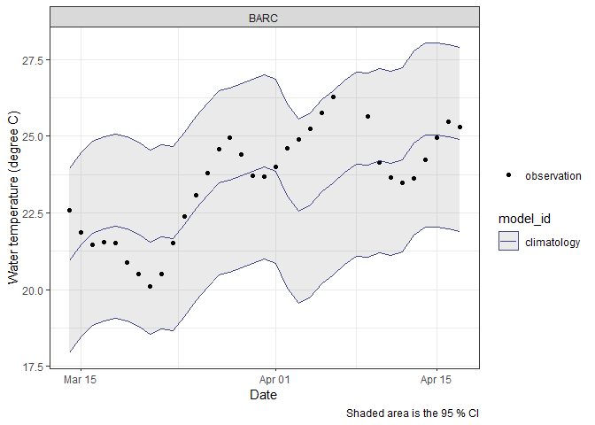
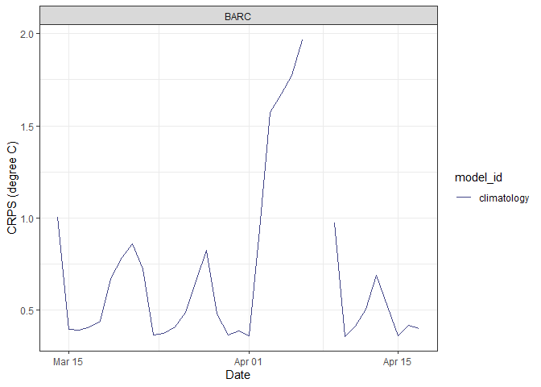
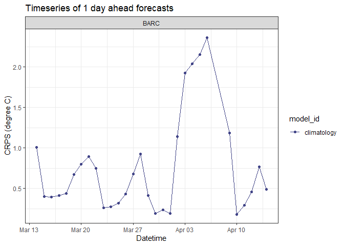
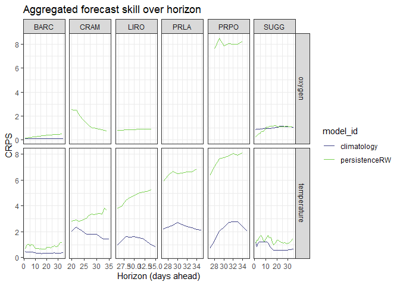
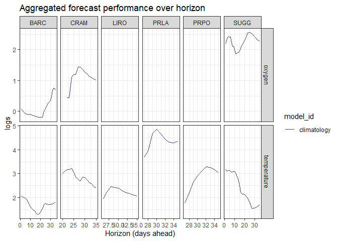
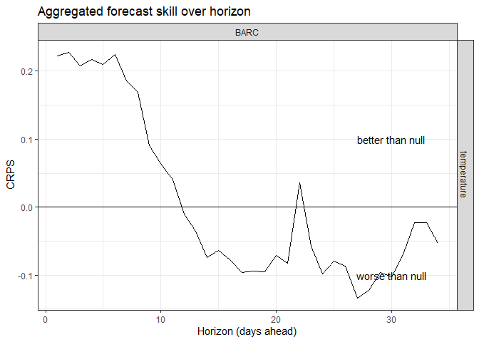

-   <a href="#background-on-scores-and-skill"
    id="toc-background-on-scores-and-skill">1 Background on scores and
    skill</a>
-   <a href="#this-tutorial" id="toc-this-tutorial">2 This tutorial</a>
    -   <a href="#setting-up-the-repository"
        id="toc-setting-up-the-repository">2.1 Setting up the repository</a>
    -   <a href="#connect-to-the-bucket" id="toc-connect-to-the-bucket">2.2
        Connect to the bucket</a>
    -   <a href="#subsetting-and-collecting-the-scores"
        id="toc-subsetting-and-collecting-the-scores">2.3 Subsetting and
        collecting the scores</a>
    -   <a href="#visualising-and-summarising-forecast-scores"
        id="toc-visualising-and-summarising-forecast-scores">2.4 Visualising and
        summarising forecast scores</a>
        -   <a href="#comparing-an-inidivudal-forecast-for-multiple-models"
            id="toc-comparing-an-inidivudal-forecast-for-multiple-models">2.4.1
            Comparing an inidivudal forecast for multiple models</a>
        -   <a href="#one-day-ahead-forecasts-over-time"
            id="toc-one-day-ahead-forecasts-over-time">2.4.2 One day ahead forecasts
            over time</a>
        -   <a href="#forecast-performance-over-horizon"
            id="toc-forecast-performance-over-horizon">2.4.3 Forecast performance
            over horizon</a>
        -   <a href="#forecast-skill" id="toc-forecast-skill">2.4.4 Forecast
            skill</a>
-   <a href="#next-steps" id="toc-next-steps">3 Next steps</a>

# 1 Background on scores and skill

From the first part of the tutorial we have gone through a simple
forecast submission workflow. This submits your forecast to an AWS
bucket which will automatically undergo ‘scoring’, comparing your
prediction (and the associated uncertainty) with the observations
collected by NEON to produce score metrics. These scores tell us how
well each model was able to reproduce the observations, with lower
scores indicating higher performance (and lower error).

One useful consideration when thinking about forecast performance is to
compare this with established null models. The null models for each
theme varies (see the documentation), but often includes the persistence
model and/or the DOY mean (climatology). The submitted model forecast
performance relative to these null models is termed the forecast skill
and is useful for understanding when and where a forecast model provides
utility above and beyond a simple null model.

# 2 This tutorial

In this tutorial, we will go through some simple steps to access,
visualise and analyse your (and others’) forecasts and scores so that we
can start to understand how forecast performance varies among models,
sites, and variables. We can think about this across the whole Challenge
or within a particular theme. We will start with just the `aquatics`
theme to start with but the process will be similar for most of the
Challenge themes.

## 2.1 Setting up the repository

We will start by setting up the work space and environment to be able to
grab the files from the AWS buckets and having the relevant packages.
First, we need to unset any environmental variables relating the AWS
buckets to ensure we can access the right locations containing the
forecast scores. We will also need the `tidyverse` and `arrow` packages,
which can be installed here if you don’t already have them.

``` r
# install required packages
install.packages('arrow')
install.packages('tidyverse')
```

## 2.2 Connect to the bucket

The first step is to connect to the relevant bucket in the neon4cast
server. This use the `s3_bucket` function from `arrow`. We will point to
the aquatics scores bucket (the other themes have their scores in a
separate bucket - for example to access the phenology scores you would
go to `neon4cast-scores/parquet/phenology`).

``` r
# connect to the scores bucket
s3 <- arrow::s3_bucket(bucket = "neon4cast-scores/parquet/aquatics", endpoint_override= "data.ecoforecast.org")
```

The object generated (`s3`), in an active binding to that bucket. These
data are organised in a parquet data base which can be queried via the
binding we have created before bringing data into the local environment.
Note: this is a similar process to what you do when you use the
`neon4cast::stage_2()` and `neon4cast::stage_3()` functions to get the
NOAA weather forecasts (see other tutorial information).

## 2.3 Subsetting and collecting the scores

The scores parquet database is organised by `model_id` -\> `datetime`,
but you can also subset based on the other variables that we included in
the forecast such as `site_id`, `reference_datetime`, and `variable`.

Once you have decided what forecast score you want to investigate you
can filter based on these columns. For example you might only want
particular forecast models (`model_id`), or forecasts generated on a
particular day (`reference_datetime`), or forecasts for a particular
variable (`variable`), or a combination of these things.

Tip: If you’re not getting the data you want, make sure to note the
column types when subsetting. For example `reference_datetime` is a
string (or character) whereas `datetime` is a timestamp.

We will subset the score files by `model_id`, `site_id`, `variable`, and
`reference_datetime`.

``` r
#these are the filters you will put in
get_models <- c('persistenceRW', 'climatology', 'fARIMA') # the name of your models/the models you are interested in

# Tip: if you are only interested in getting forecasts from one model it is quicker to go directly to that part of the bucket using the s3_bucket function. For example to access the persistence forecasts we would go to:
# s3 <- arrow::s3_bucket(bucket = "neon4cast-scores/parquet/aquatics/model_id=persistenceRW", endpoint_override= "data.ecoforecast.org")
# This is only possible for the model_id filter!

start_ref_date <- as_date('2023-03-13') # what period do you want the scores for?
end_ref_date <- as_date('2023-04-13')
get_refdates <- as.character(seq(start_ref_date, end_ref_date, by = 'day'))

get_sites <- readr::read_csv("https://raw.githubusercontent.com/eco4cast/neon4cast-targets/main/NEON_Field_Site_Metadata_20220412.csv", show_col_types = F) |> 
  dplyr::filter(field_site_subtype == 'Lake') |> # Subset to the lake sites
  select(field_site_id) |> 
  pull() # get in a vector

get_variables <- c('temperature', 'oxygen', 'chla')
```

We now have 4 vectors that we will filter the dataset by. Start by
opening the dataset (`open_dataset`), then `filter` based on the above
vectors. The final step is to `collect()` this into your local
environment. This process can be slow.

We will also calculate the forecast horizon for each time step. This
will be the difference between the `datetime` and the date of forecast
generation or the `reference_dateime`.

``` r
# connect to the bucket and grab the scores
scores <- open_dataset(s3) |>
  filter(reference_datetime %in% get_refdates,
         model_id %in% get_models,
         site_id %in% get_sites,
         variable %in% get_variables) |> 
  collect() |> 

  # Note: this can be slow so be patient 
  # The dataframe might also be very large depending on the filters you put in above
  mutate(horizon = as.numeric(as_date(datetime) - as_date(reference_datetime)))
```

Tip: If you want to know what `datetime`s/`model_id`s/`site_id`s are
avaialble you can use other `dplyr` functions to investigate the
dataset. For example, to discover what `model_id`s are present on
`2023-01-01` we can use `distinct`.

``` r
 open_dataset(s3) |>
  filter(reference_datetime == "2023-01-01") |> 
  distinct(model_id) |> 
  collect()
```

As these steps can be quite time consuming we can generate a local copy
of this data frame to query more quickly using other functions from
`arrow`. In these functions the `partitioning` refers to the variables
which will be used to split the data up. It is recommended that the
variables you will be using to subset and query the data on more
frequently should be included in the partition, as it speeds up some of
the querying process.

``` r
scores |> 
    arrow::write_dataset("scores", partitioning=c("model_id", "site_id"))
```

We can know query this again without having to access the AWS bucket.
This would be done like this to get only forecasts at Barco Lake. Note:
Remember the models and reference_datetimes represented in this dataset
are what you selected above.

``` r
scores <- arrow::open_dataset("../scores") |> 
  filter(site_id == 'BARC') |> 
  collect()
```

We should first look at what columns this scores data frame includes.

``` r
scores |> 
  glimpse()
```

    ## Rows: 38,083
    ## Columns: 18
    ## $ reference_datetime <chr> "2023-03-13", "2023-03-13", "2023-03-13", "2023-03-…
    ## $ site_id            <chr> "BARC", "BARC", "BARC", "SUGG", "SUGG", "SUGG", "BA…
    ## $ datetime           <date> 2023-03-14, 2023-03-14, 2023-03-14, 2023-03-14, 20…
    ## $ family             <chr> "normal", "normal", "normal", "normal", "normal", "…
    ## $ variable           <chr> "chla", "oxygen", "temperature", "chla", "oxygen", …
    ## $ observation        <dbl> 1.470669, 7.832986, 22.587153, 12.034545, 6.867569,…
    ## $ crps               <dbl> 0.2405135, 0.2422642, 1.0953503, 1.2261785, 0.29890…
    ## $ logs               <dbl> 0.9263947, 0.5093298, 2.0183394, 2.4939049, 0.87981…
    ## $ mean               <dbl> 1.336449, 8.222685, 20.825678, 13.311944, 6.387955,…
    ## $ median             <dbl> 1.336449, 8.222685, 20.825678, 13.311944, 6.387955,…
    ## $ sd                 <dbl> 0.9984214, 0.3285341, 1.4832685, 4.6518436, 0.80537…
    ## $ quantile97.5       <dbl> 3.293319, 8.866600, 23.732831, 22.429390, 7.966470,…
    ## $ quantile02.5       <dbl> -0.6204208, 7.5787702, 17.9185253, 4.1944985, 4.809…
    ## $ quantile90         <dbl> 2.978706, 8.763076, 23.265438, 20.963546, 7.712687,…
    ## $ quantile10         <dbl> -0.3058079, 7.6822947, 18.3859186, 5.6603426, 5.063…
    ## $ model_id           <chr> "climatology", "climatology", "climatology", "clima…
    ## $ date               <chr> "2023-03-14", "2023-03-14", "2023-03-14", "2023-03-…
    ## $ horizon            <dbl> 1, 1, 1, 1, 1, 1, 2, 2, 2, 2, 2, 2, 1, 1, 1, 1, 1, …

Within the scores we have some id variables (`reference_datetime`,
`datetime`, `family`, `variable`, `horizon`, `model_id`, `site_id`),
some columns that include summary statistics of the submitted forecast
(`mean`, `median`, `sd`, information on confidence intervals:
`quantile97.5`,`quantile02.5`, `quantile90`,`quantile10`) and finally
some columns that allow us to assess forecast performance against the
NEON `observation`. These performance metrics are the `crps` and `logs`.
You can read more about these two metrics in the
[documentation](https://projects.ecoforecast.org/neon4cast-docs/Evaluation.html).
The key things to know are that CRPS (Continuous Rank Probablity Score)
is in native units (e.g. mg/L for dissolved oxygen) logs (Log score) is
unitless and that for both the lower the value the better the forecast
performance. These metrics use the accuracy of the mean and the spread
of the predictions.

## 2.4 Visualising and summarising forecast scores

We will explore some ways you might want to investigate and visualise
the performance of the forecasts. We currently have 32 individual
`reference_datetimes`, over 3 `variables`, 7 `site_id`s and 3 forecast
`model_id`s.

### 2.4.1 Comparing an inidivudal forecast for multiple models

We will try looking at temperature forecasts generated by our models for
one forecast date at one site and look at how this compares with the
observations.

``` r
filtered_scores <- scores |> 
  filter(variable == get_variables[1],
         reference_datetime == get_refdates[1],
         site_id == get_sites[1],
         model_id %in% get_models[1:2]) 

filtered_scores |> 
  ggplot(aes(x = datetime)) +
  geom_point(aes(y=observation, shape='observation')) +
  geom_ribbon(aes(ymax= quantile97.5,
                  ymin = quantile02.5,
                  colour = model_id),
              alpha = 0.1) +
  geom_line(aes(y = mean, 
                colour = model_id)) +
  facet_wrap(~site_id, scales = 'free') +
  
  # Make it better to look at 
  scale_colour_viridis_d(begin = 0.2, end = 0.8) +
  scale_shape(name = '') +
  labs(y= 'Water temperature (degree C)', x= 'Date', caption = 'Shaded area is the 95 % CI') +
  theme_bw()
```



These initial plots are useful for visually looking at the forecast
skill but to quantitatively access we can useful one of the scoring
metrics (CRPS or logs).

``` r
filtered_scores |> 
  ggplot(aes(x = datetime)) +
  geom_line(aes(y = crps, 
                colour = model_id)) +
  facet_wrap(~site_id, scales = 'free') +
  
  # Make it better to look at 
  scale_colour_viridis_d(begin = 0.2, end = 0.8) +
  scale_shape(name = '') +
  labs(y= 'Water temperature (degree C)', x= 'Date') +
  theme_bw()
```



Notice the gap in the scoring…this occurs because we have no observation
at this date at this site so the forecast cannot be scored. This is also
just one forecast and it might be interesting to look at more summarised
output to see how models perform over multiple forecasts.

### 2.4.2 One day ahead forecasts over time

One summary we could look at is how a forecast of tomorrow performs
across a particular time frame. We could do this by filtering the scores
data frame to just ones where `horizon == 1` and plotting how the skill
score changes over time.

``` r
scores |> 
  filter(horizon == 1,
         
         variable == get_variables[1],
         site_id == get_sites[1],
         model_id %in% get_models[1:2]) |> 
  na.omit(crps) |> 
  ggplot(aes(x=datetime, y=crps, colour = model_id)) +
  geom_line() +
  geom_point() +
  facet_wrap(~site_id)  +
  
  # Make it better to look at 
  scale_colour_viridis_d(begin = 0.2, end = 0.8) +
  labs(y= 'CRPS (degree C)', x= 'Datetime', title = 'Timeseries of 1 day ahead forecasts') +
  theme_bw()
```



### 2.4.3 Forecast performance over horizon

How do different model generally perform over forecast horizon? We can
aggregate the forecasts to summarise the score based on how far into the
future the forecast is for. For example, we could look at every 1 day
ahead forecast vs every 7 day ahead forecast and see how this varies by
site.

``` r
scores |> 
  na.omit(observation) |>  # only takes datetimes with observations
  filter(variable %in% get_variables[1:2], 
         model_id %in% get_models[1:2]) |> 
  group_by(horizon, variable, site_id, model_id) |> 
  summarise(crps = median(crps)) |> 
  ggplot(aes(x = horizon, y = crps, colour = model_id)) +
  geom_line() +
  facet_grid(variable~site_id, scales = 'free') +
  
  
   # Make it better to look at 
  scale_colour_viridis_d(begin = 0.2, end = 0.8) +
  labs(y= 'CRPS', x= 'Horizon (days ahead)', title = 'Aggregated forecast skill over horizon') +
  theme_bw()
```



One thing to note is that the CRPS reports in native units (mg/L for DO
and degrees celcius for temperature), and so cannot be easily compared.
We can use logs scores in this case.



Also these summary plots work better when there are multiple forecasts
at each horizon (ie. if you have, for example, a year of forecasts). The
N value on a lot of these means is small.

### 2.4.4 Forecast skill

As noted above forecast skill relates the forecast performance of a
model of interest to a null model. We can look at a simple ARIMA model
to see how it compares to one of our null models (persistence) to give a
metric of ‘skill’. We can calculate the difference between our null
model and model of interest to estimate ‘skill’. There are a few ways to
do this but for simplicity we will just look at the difference in metric
scores (null - model), meaning positive value indicate a skillful
forecast (CRPS_null \> CRPS_model)

``` r
scores |> 
  filter(model_id %in% c('persistenceRW', 'fARIMA'), 
         variable == 'temperature',
         site_id == 'BARC') |> 
  
  select(reference_datetime, site_id, datetime, variable, crps, model_id, horizon) |> 
  
  pivot_wider(values_from = crps, 
              names_from = model_id) |> 
  mutate(relative_skill = persistenceRW-fARIMA) |> 
  
  group_by(horizon, variable, site_id) |> 
  summarise(relative_skill = median(relative_skill, na.rm = T)) |> 
  
  ggplot(aes(x = horizon, y = relative_skill)) +
  geom_line() +
  facet_grid(variable~site_id, scales = 'free') +
  
  
   # Make it better to look at 
  scale_colour_viridis_d(begin = 0.2, end = 0.8) +
  labs(y= 'CRPS', x= 'Horizon (days ahead)', title = 'Aggregated forecast skill over horizon') +
  theme_bw() +
  
  
  # compare with the null
  geom_hline(yintercept = 0) +
  annotate(geom = 'text', x = 30, y =  0.1, label = 'better than null')+
  annotate(geom = 'text', x = 30, y =  -0.1, label = 'worse than null')
```



# 3 Next steps

-   You can use this code to look at how well different models are doing
    compared to a model of interest
-   And answer synthesis questions such as: Are there particular sites
    that generally have better/worse predictions? Is this the same
    across variables? Which models perform best at each site?
-   At what horizon is a model of interest better than a null model?
