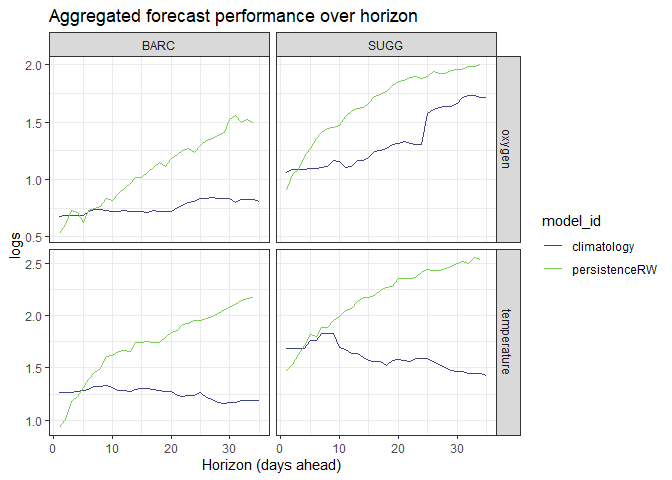
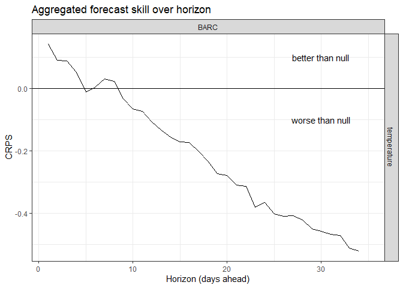

-   [1 Background on scores and skill](#background-on-scores-and-skill)
-   [2 This tutorial](#this-tutorial)
    -   [2.1 Working with arrow and parquet
        datasets](#working-with-arrow-and-parquet-datasets)
    -   [2.2 Opening the bucket](#opening-the-bucket)
    -   [2.3 Querying the database](#querying-the-database)
    -   [2.4 Scores analysis](#scores-analysis)
    -   [2.5 Visualising and summarising forecast
        scores](#visualising-and-summarising-forecast-scores)
        -   [2.5.1 Comparing an inidivudal forecast for multiple
            models](#comparing-an-inidivudal-forecast-for-multiple-models)
        -   [2.5.2 One day ahead forecasts over
            time](#one-day-ahead-forecasts-over-time)
        -   [2.5.3 Forecast performance over
            horizon](#forecast-performance-over-horizon)
        -   [2.5.4 Forecast skill](#forecast-skill)
-   [3 Next steps](#next-steps)
-   [4 Tips and tricks](#tips-and-tricks)
    -   [4.1 Another way to access the same
        files](#another-way-to-access-the-same-files)
    -   [4.2 Writing locally](#writing-locally)

# 1 Background on scores and skill

The Submit_forecast tutorial took you through gone through a simple
forecast submission workflow to submit your forecast to an AWS bucket
which will automatically undergo ‘scoring’, i.e. comparing your
prediction (and the associated uncertainty) with the observations
collected by NEON to produce score metrics. These scores tell us how
well each model was able to reproduce the observations, with lower
scores indicating higher performance (and lower error).

One useful consideration when thinking about forecast performance is to
compare your forecast scores with established null models. The null
models for each theme varies (see the documentation), but often includes
the persistence model and/or the historical day-of-year mean
(climatology). The submitted model forecast performance relative to
these null models is termed the *forecast skill* and is useful for
understanding when and where a forecast model provides utility above and
beyond a simple null model.

# 2 This tutorial

In this tutorial, we will go through some simple steps to access,
visualise and analyse your (and others’) forecasts and scores so that we
can start to understand how forecast performance varies among models,
sites, and variables. We can think about this across the whole Challenge
or within a particular theme. We will start with just the `aquatics`
theme to start with but the process will be similar for the other
Challenge themes.

## 2.1 Working with arrow and parquet datasets

Parquet files are a file type that are useful for organising large
structured datasets. They can be accessed in similar ways to databases
in which we run “queries” to access subsets of the dataset across
multiple individual files. The NEON Challenge utilises this file format
and you can access forecasts, drivers (NOAA forecasts), and scores from
these parquet databases.

There are multiple ways to access and subset these large datasets and
the way you do this impacts the number of files that are opened and then
therefore the speed that the query takes.

I’m going to show you a couple of examples of how you can query and look
at the data.

To start you need to identify the location of the data (this can be a
local directory but for the NEON Challenge data it’s on an S3
bucket/location). The dataset has been cataloged and is available on a
[STAC
catalog](https://radiantearth.github.io/stac-browser/#/external/raw.githubusercontent.com/eco4cast/neon4cast-ci/main/catalog/catalog.json).
In here you navigate to one of the sections (Scores/Forecasts/…) and go
to Assets \> Database acces \> Copy URL for S3.

``` r
scores_location <- "s3://anonymous@bio230014-bucket01/challenges/scores/bundled-parquet/project_id=neon4cast?endpoint_override=sdsc.osn.xsede.org"
```

This is a long link that is comprised of a couple of important parts: 1.
`anonymous` - doesn’t require credentialed access 2.
`bio230014-bucket01` - the name of the s3 bucket 3. the rest is info
about the subsets of the data that can kind of be thought of like
subdirectories within the top `challenges` bucket (this is for the
scores data for the neon4cast project) 4. `endpoint_override` - the
ultimate location of the bucket, remember for later!

## 2.2 Opening the bucket

We can set the s3 bucket in our environment using the `arrow` package.
We will also use tidyverse to do our queries
(`select`/`filter`/`distinct` etc.)

``` r
# install.package('arrow')
# install.package('tidyverse')
library(arrow)
```

    ## Warning: package 'arrow' was built under R version 4.2.3

    ## 
    ## Attaching package: 'arrow'

    ## The following object is masked from 'package:utils':
    ## 
    ##     timestamp

``` r
library(tidyverse)
```

    ## Warning: package 'tidyverse' was built under R version 4.2.3

    ## Warning: package 'ggplot2' was built under R version 4.2.3

    ## Warning: package 'tibble' was built under R version 4.2.3

    ## Warning: package 'tidyr' was built under R version 4.2.3

    ## Warning: package 'readr' was built under R version 4.2.3

    ## Warning: package 'purrr' was built under R version 4.2.3

    ## Warning: package 'dplyr' was built under R version 4.2.3

    ## Warning: package 'stringr' was built under R version 4.2.3

    ## Warning: package 'forcats' was built under R version 4.2.3

    ## Warning: package 'lubridate' was built under R version 4.2.3

    ## ── Attaching core tidyverse packages ──────────────────────── tidyverse 2.0.0 ──
    ## ✔ dplyr     1.1.3     ✔ readr     2.1.4
    ## ✔ forcats   1.0.0     ✔ stringr   1.5.1
    ## ✔ ggplot2   3.5.0     ✔ tibble    3.2.1
    ## ✔ lubridate 1.9.3     ✔ tidyr     1.3.1
    ## ✔ purrr     1.0.2

    ## ── Conflicts ────────────────────────────────────────── tidyverse_conflicts() ──
    ## ✖ lubridate::duration() masks arrow::duration()
    ## ✖ dplyr::filter()       masks stats::filter()
    ## ✖ dplyr::lag()          masks stats::lag()
    ## ℹ Use the conflicted package (<http://conflicted.r-lib.org/>) to force all conflicts to become errors

We use the `arrow` package to tell the computer where to look for the
data. We’ll look at the scores using `open_dataset()`:

``` r
all_scores <- arrow::open_dataset(scores_location)
```

The object generated, `all_scores`, is an ‘object containing active
binding’…). This has created a connection to the dataset at the location
you pointed to in `scores_location` which can then be queried (using
`dplyr` functions) before bringing locally. This is what this object
look like:

    ## FileSystemDataset with 448 Parquet files
    ## reference_datetime: timestamp[us, tz=UTC]
    ## site_id: string
    ## datetime: timestamp[us, tz=UTC]
    ## family: string
    ## pub_datetime: timestamp[us, tz=UTC]
    ## observation: double
    ## crps: double
    ## logs: double
    ## mean: double
    ## median: double
    ## sd: double
    ## quantile97.5: double
    ## quantile02.5: double
    ## quantile90: double
    ## quantile10: double
    ## duration: string
    ## model_id: string
    ## project_id: string
    ## variable: string

which shows it is a `FileSystemDataset with 448 Parquet files` and then
lists the columns and the column types (these are things that can be
queried).

## 2.3 Querying the database

Rather than trying to get every score of every variable from every model
we can subset the data. We use the `dplyr` functions and then
`collect()` to do this. Here is an example of this first way of querying
the bucket:

``` r
variable_query <- 'temperature'
site_id_query <- 'TOOK'
model_id_query <- 'persistenceRW'
reference_datetime_query <- as_date('2024-08-01') # needds to be a date format!

# use the "object containing active binding"
query_scores <- all_scores |> 
  dplyr::filter(variable == variable_query, 
                site_id == site_id_query, 
                model_id == model_id_query,
                reference_datetime == reference_datetime_query) |> 
  collect() # needed to finish the query and bring locally, without this it will return info on how many parquet files the query returns
```

> NOTE: I WOULD NOT RECOMMEND RUNNING THIS, IT IS SLOW AND POTENTIALLY
> TAKES A LONG AND MIGHT BREAK YOUR COMPUTER. This is very slow because
> it has to open every file and check to see if information in the file
> matches our query.

> Tip: If you’re not getting the data you expect, make sure to note the
> column types when subsetting (character, timestamp, etc.).

It also requires you to know in some ways what you are looking for. Some
of this work by organisers by cataloging the information which you can
navigate in a point and click way within the catalog (so you can
browse). For the above example we can make it quicker by going into the
model and variable of interest. So for persistenceRW for temperature
that would be
[here](https://radiantearth.github.io/stac-browser/#/external/raw.githubusercontent.com/eco4cast/neon4cast-ci/main/catalog/scores/Aquatics/Daily_Water_temperature/models/persistenceRW.json)
and looking up the s3 location on the Database Access tab we can follow
the same steps:

``` r
some_scores_location <- "s3://anonymous@bio230014-bucket01/challenges/scores/bundled-parquet/project_id=neon4cast/duration=P1D/variable=temperature/model_id=persistenceRW?endpoint_override=sdsc.osn.xsede.org"
some_scores <- arrow::open_dataset(some_scores_location)
some_scores
```

    ## FileSystemDataset with 1 Parquet file
    ## reference_datetime: timestamp[us, tz=UTC]
    ## site_id: string
    ## datetime: timestamp[us, tz=UTC]
    ## family: string
    ## pub_datetime: timestamp[us, tz=UTC]
    ## observation: double
    ## crps: double
    ## logs: double
    ## mean: double
    ## median: double
    ## sd: double
    ## quantile97.5: double
    ## quantile02.5: double
    ## quantile90: double
    ## quantile10: double

Now this is only 1 file! And the query should be quicker and less memory
intensive. In the above example the location link is much longer and
includes additional information on the duration, variable, and model_id.
These are called **partitions**, and we can navigate to different levels
within the partitions to speed up some querying.

Because you are already navigated to the `variable` and `model_id`
levels that you are interested in you can remove these from the query:

``` r
# variable_query <- 'temperature' # no loner needed
site_id_query <- 'TOOK'
# model_id_query <- 'persistenceRW' # no longer needed
reference_datetime_query <- as_date('2024-08-01') # needds to be a date format!

# use the "object containing active binding"
query_some_scores <- some_scores |> 
  dplyr::filter(site_id == site_id_query, 
                reference_datetime == reference_datetime_query) |> 
  collect() 
# needed to finish the query and bring locally
# without this it will return info on how many parquet files the query returns
```

This is a single site, single date score!

    ## Rows: 130
    ## Columns: 15
    ## $ reference_datetime <dttm> 2024-08-01, 2024-08-01, 2024-08-01, 2024-08-01, 20…
    ## $ site_id            <chr> "TOOK", "TOOK", "TOOK", "TOOK", "TOOK", "TOOK", "TO…
    ## $ datetime           <dttm> 2024-08-19, 2024-08-10, 2024-08-11, 2024-08-28, 20…
    ## $ family             <chr> "sample", "sample", "sample", "sample", "sample", "…
    ## $ pub_datetime       <dttm> 2024-08-23 12:15:00, 2024-08-23 12:15:00, 2024-08-…
    ## $ observation        <dbl> 10.690005, 12.990000, 12.739130, 9.070627, 11.99147…
    ## $ crps               <dbl> 1.4418730, 0.5689784, 0.6473680, 2.4525575, 0.82405…
    ## $ logs               <dbl> 2.450047, 1.778185, 1.878128, 2.937972, 1.953193, 3…
    ## $ mean               <dbl> 13.05737, 13.27949, 13.29286, 12.98030, 13.21153, 1…
    ## $ median             <dbl> 12.87911, 13.30664, 13.42315, 12.91765, 13.29858, 1…
    ## $ sd                 <dbl> 3.987435, 3.024028, 3.119122, 4.611229, 1.818266, 5…
    ## $ quantile97.5       <dbl> 20.74324, 20.08676, 20.47006, 21.10618, 16.32044, 2…
    ## $ quantile02.5       <dbl> 5.3087908, 7.1820525, 6.9729299, 2.0227346, 7.71393…
    ## $ quantile90         <dbl> 19.73577, 18.51891, 18.46756, 20.23551, 15.43439, 1…
    ## $ quantile10         <dbl> 6.841891, 7.932822, 7.868955, 5.568818, 10.626983, …

We can inspect this data to see what we’ve got!

Another useful thing to do is to look at what data are in there. For
example, what are the reference_datetimes available at TOOK for
persistenceRW. And for this we can use `distinct()` in our query:

``` r
some_scores |> 
  dplyr::filter(site_id == site_id_query) |>
  dplyr::distinct(reference_datetime) |> 
  collect() |> head() # look at top rows only
```

    ## # A tibble: 6 × 1
    ##   reference_datetime 
    ##   <dttm>             
    ## 1 2024-01-06 00:00:00
    ## 2 2023-01-02 00:00:00
    ## 3 2022-12-22 00:00:00
    ## 4 2022-12-08 00:00:00
    ## 5 2023-02-09 00:00:00
    ## 6 2024-05-31 00:00:00

Or what other sites are available on that same reference_datetime:

``` r
some_scores |> 
  dplyr::filter(reference_datetime == reference_datetime_query) |>
  dplyr::distinct(site_id) |> 
  collect() |> head() # look at top rows only
```

    ## # A tibble: 6 × 1
    ##   site_id
    ##   <chr>  
    ## 1 WLOU   
    ## 2 PRLA   
    ## 3 COMO   
    ## 4 ARIK   
    ## 5 KING   
    ## 6 FLNT

> Note: use `pull(as_vector = TRUE)` instead of `collect()` to return a
> vector rather than a dataframe (can sometimes be a more useful
> format!).

You could also do the same type of `distinct()` queries at higher
partition levels (e.g. on the all_scores binding location) but it’s
going to be slow and memory intensive.

> Note: the deeper in and more specific your binding location,
> generally, the quicker the queries and collection (it’s not opening so
> many files) but if you need multiple models or variables you will need
> to query using `filter()` instead.

## 2.4 Scores analysis

Now we know how to access the data we will look at what types of
analysis can be done with it. For this example, we will query the scores
database for a number of model_ids, sites, dates, and variables,
starting by specifying each of these vectors:

``` r
# the name of your models/the models you are interested in
get_models <- c('persistenceRW', 'climatology', 'fARIMA') 

# what period do you want the scores for?
start_ref_date <- as_date('2024-05-31') 
end_ref_date <- as_date('2024-06-30')
get_refdates <-seq(start_ref_date, end_ref_date, by = 'day')

# what sites?
get_sites <- c('BARC', 'SUGG')

# what variables?
get_variables <- c('temperature', 'oxygen')
```

We now have 4 vectors that we will filter the dataset by. Use the
`all_scores` binding and `filter` based on the above vectors and
`collect()` this into your local environment. This process can be slow
so be patient as we are fetching a large number of scores.

``` r
# connect to the bucket and grab the scores
scores_analysis <- all_scores |>
  filter(variable %in% get_variables,
         reference_datetime %in% get_refdates,
         model_id %in% get_models,
         site_id %in% get_sites) |> 
  collect()

# The dataframe might also be very large depending on the filters you put in above
```

We should first look at what columns this scores data frame includes.

``` r
scores_analysis |> glimpse()
```

    ## Rows: 47,004
    ## Columns: 19
    ## $ reference_datetime <dttm> 2024-06-06, 2024-06-01, 2024-05-31, 2024-06-19, 20…
    ## $ site_id            <chr> "BARC", "SUGG", "SUGG", "SUGG", "BARC", "BARC", "BA…
    ## $ datetime           <dttm> 2024-06-09, 2024-06-24, 2024-06-12, 2024-07-09, 20…
    ## $ family             <chr> "normal", "normal", "normal", "normal", "normal", "…
    ## $ pub_datetime       <dttm> 2024-06-07 00:07:09, 2024-06-01 22:03:40, 2024-05-…
    ## $ observation        <dbl> 31.03910, 30.55169, 31.27774, 30.94947, 30.64129, 3…
    ## $ crps               <dbl> 0.7543786, 0.7488162, 1.6210921, 0.5405557, 0.35103…
    ## $ logs               <dbl> 1.663328, 1.690209, 2.570810, 1.472962, 1.154763, 1…
    ## $ mean               <dbl> 29.77436, 29.29361, 28.86052, 30.08257, 30.15541, 3…
    ## $ median             <dbl> 29.77436, 29.29361, 28.86052, 30.08257, 30.15541, 3…
    ## $ sd                 <dbl> 1.3989462, 1.5662006, 1.5526055, 1.4584336, 1.15955…
    ## $ quantile97.5       <dbl> 32.51625, 32.36331, 31.90358, 32.94104, 32.42809, 3…
    ## $ quantile02.5       <dbl> 27.03248, 26.22392, 25.81747, 27.22409, 27.88273, 2…
    ## $ quantile90         <dbl> 32.07542, 31.86978, 31.41433, 32.48148, 32.06270, 3…
    ## $ quantile10         <dbl> 27.47330, 26.71744, 26.30672, 27.68366, 28.24812, 2…
    ## $ duration           <chr> "P1D", "P1D", "P1D", "P1D", "P1D", "P1D", "P1D", "P…
    ## $ model_id           <chr> "climatology", "climatology", "climatology", "clima…
    ## $ project_id         <chr> NA, NA, NA, NA, NA, NA, NA, NA, NA, NA, NA, NA, NA,…
    ## $ variable           <chr> "temperature", "temperature", "temperature", "tempe…

Within the scores we have some ID variables (`reference_datetime`,
`datetime`, `family`, `variable`, `horizon`, `model_id`, `site_id`),
some columns that include summary statistics of the submitted forecast
(`mean`, `median`, `sd`, information on confidence intervals
(`quantile97.5`,`quantile02.5`, `quantile90`,`quantile10`) and finally
some columns that allow us to assess forecast performance against the
NEON `observation`. These performance metrics are the `crps` and `logs`.
You can read more about these two metrics in the
[documentation](https://projects.ecoforecast.org/neon4cast-docs/Evaluation.html).
The key things to know are that both metrics evaluate the accuracy and
precision of the forecasts (both the mean prediction and the spread).
The CRPS (Continuous Rank Probablity Score) is given in native units
(e.g. mg/L for dissolved oxygen) logs (Log score) is unitless. For both,
the lower the value the better the forecast performance.

> Note: Because CRPS reports in native units (mg/L for DO and degrees
> Celsius for temperature etc.), it is more difficult to compare across
> variables. Using logs scores would be more appropriate in this case.

In addition to the we can calculate the *forecast horizon* for each time
step (how far in the future is the prediction for). This will be the
difference between the `datetime` and the date of forecast generation or
the `reference_dateime`.

``` r
scores_analysis <- scores_analysis |> 
  arrange(reference_datetime, datetime) |> 
  mutate(horizon = as.numeric(as_date(datetime) - as_date(reference_datetime)))
```

## 2.5 Visualising and summarising forecast scores

We will explore some ways you might want to investigate and visualise
the performance of the forecasts. We currently have 31 individual
`reference_datetimes`, 2 `site_id`s and 3 forecast `model_id`s.

### 2.5.1 Comparing an inidivudal forecast for multiple models

We will try looking at temperature forecasts generated by our models for
one forecast date at one site and look at how this compares with the
observations. Here we plot the forecast With uncertainty of the two null
models along with the observations.

``` r
filtered_scores <- scores_analysis |> 
  filter(variable == get_variables[1],
         reference_datetime == get_refdates[1],
         site_id == get_sites[1],
         model_id %in% get_models[1:2]) 

filtered_scores |> 
  ggplot(aes(x = datetime)) +
  geom_point(aes(y=observation, shape='observation')) +
  geom_ribbon(aes(ymax= quantile97.5,
                  ymin = quantile02.5,
                  fill = model_id),
              alpha = 0.1) +
  geom_line(aes(y = mean, 
                colour = model_id)) +
  facet_wrap(~site_id, scales = 'free') +
  
  # Make it better to look at 
  scale_colour_viridis_d(begin = 0.2, end = 0.8) +
  scale_fill_viridis_d(begin = 0.2, end = 0.8) +
  scale_shape(name = '') +
  labs(y= 'Water temperature (degree C)', x= 'Date', caption = 'Shaded area is the 95 % CI') +
  theme_bw()
```


These types of plots are useful for visually looking at the forecast
skill but to quantitatively access we can useful one of the scoring
metrics (CRPS or logs). Remember lower scores = better performance.

``` r
filtered_scores |>
  group_by(site_id, variable, model_id, reference_datetime, datetime) |> 
  slice_head(n = 1) |> 
  ggplot(aes(x = datetime)) +
  geom_line(aes(y = crps, 
                colour = model_id)) +
  facet_wrap(~site_id, scales = 'free') +
  
  # Make it better to look at 
  scale_colour_viridis_d(begin = 0.2, end = 0.8) +
  scale_shape(name = '') +
  labs(y= 'CRPS (degree C)', x= 'Date') +
  theme_bw()
```


We see that the persistenceRW null model does well earlier in the
forecast than later, and the climatology is kind of all over! If we want
to extract patterns in how models perform one forecast is not really
enough. It might be interesting and more informative to look at more
summarised output to see how models perform over multiple forecasts.

### 2.5.2 One day ahead forecasts over time

One summary we could look at is how a forecast of tomorrow performs
across a particular time frame. We could do this by filtering the scores
data frame to just ones where `horizon == 1` and plotting how the skill
score changes over time.

``` r
scores_analysis |> 
  filter(horizon == 1,
         variable == get_variables[1],
         site_id == get_sites[1],
         model_id %in% get_models[1:2]) |>
  group_by(site_id, variable, model_id, reference_datetime, datetime) |> 
  slice_head(n = 1) |> 
  ggplot(aes(x=datetime, y=crps, colour = model_id)) +
  geom_line() +
  geom_point() +
  facet_wrap(~site_id)  +
  
  # Make it better to look at 
  scale_colour_viridis_d(begin = 0.2, end = 0.8) +
  labs(y= 'CRPS (degree C)', x= 'Datetime', title = 'Timeseries of 1 day ahead forecasts') +
  theme_bw()
```


Generally the persistenceRW does better at these shorter horizons for
more forecast days. What about other horizons?

### 2.5.3 Forecast performance over horizon

We could look at how different model perform over different forecast
horizons? We can aggregate the forecasts to summarise the score based on
how far into the future the forecast is for. For example, we could look
at how the scores varying at all the horizons and see this varies by
site.

``` r
scores_analysis |> 
  filter(variable %in% get_variables[1], 
         model_id %in% get_models[1:2]) |> 
  reframe(.by = c(horizon, variable, site_id, model_id), 
          crps = median(crps, na.rm = T)) |> 
  ggplot(aes(x = horizon, y = crps, colour = model_id)) +
  geom_line() +
  facet_grid(~site_id, scales = 'free') +
  
  
   # Make it better to look at 
  scale_colour_viridis_d(begin = 0.2, end = 0.8) +
  labs(y= 'CRPS (degree C)', x= 'Horizon (days ahead)', title = 'Aggregated forecast skill over horizon') +
  theme_bw()
```


The patterns look fairly similar between the two sites with persistence
lower initially but then score increases over the horizon and is beaten
by climatology around 7-10 days.

Remember CRPS is reported in native units (mg/L for DO and degrees
celcius for temperature), and so cannot be easily compared between
variables. Instead we can use logs scores in this case.



Also these summary plots work better when there are multiple forecasts
at each horizon (ie. if you have, for example, a year of forecasts). The
N value on a lot of these means is small (n = 31).

### 2.5.4 Forecast skill

As noted above forecast skill relates the forecast performance of a
model of interest compared to our null models. We can look at a simple
ARIMA model to see how it compares to one of our null models
(climatology) to give a metric of ‘skill’. We can calculate the
difference between our null model and model of interest to estimate
‘skill’. There are a few ways to do this but for simplicity we will just
look at the difference in metric scores (null - model), meaning positive
value indicate a skillful forecast (CRPS_null \> CRPS_model)

``` r
scores_analysis |> 
  filter(model_id %in% c('climatology', 'fARIMA'), 
         variable == 'temperature',
         site_id == 'BARC') |> 
  select(reference_datetime, site_id, datetime, variable, crps, model_id, horizon) |>
  group_by(site_id, variable, model_id, reference_datetime, datetime) |> 
  slice_head(n = 1) |> 
  pivot_wider(values_from = crps, 
              names_from = model_id) |> 
  mutate(relative_skill = climatology-fARIMA) |> 
  group_by(horizon, variable, site_id) |> 
  summarise(relative_skill = median(relative_skill, na.rm = T)) |> 
  ggplot(aes(x = horizon, y = relative_skill)) +
  geom_line() +
  facet_grid(variable~site_id, scales = 'free') +
  
  # Make it better to look at 
  scale_colour_viridis_d(begin = 0.2, end = 0.8) +
  labs(y= 'CRPS', x= 'Horizon (days ahead)', title = 'Aggregated forecast skill over horizon') +
  theme_bw() +
  
  # compare with the null
  geom_hline(yintercept = 0) +
  annotate(geom = 'text', x = 30, y =  0.1, label = 'better than null')+
  annotate(geom = 'text', x = 30, y =  -0.1, label = 'worse than null')
```

    ## `summarise()` has grouped output by 'horizon', 'variable'. You can override
    ## using the `.groups` argument.

    ## Warning: Removed 1 row containing missing values or values outside the scale range
    ## (`geom_line()`).



Earlier in the forecast we gain skill by using the ARIMA model but
beyond 9 days the null model is better and the skill is negative (no
additional skill is gained by using the ARIMA over the null model).

# 3 Next steps

-   You can use this code to look at how well different models are doing
    compared to a model of interest
-   And answer synthesis questions such as: Are there particular sites
    that generally have better/worse predictions? Is this the same
    across variables? Which models perform best at each site?
-   At what horizon is a model of interest better than a null model?

Explore the inventory (or STAC) for different themes, models and
variables on the [STAC
catalog](https://radiantearth.github.io/stac-browser/#/external/raw.githubusercontent.com/eco4cast/neon4cast-ci/main/catalog/catalog.json)

# 4 Tips and tricks

## 4.1 Another way to access the same files

We can also use the `s3_bucket()` function and the information above to
access the data slightly differently. This will allow us to understand
the set up of the file system and do a bit of snooping into what way the
data are structured and start to develop other queries.

``` r
s3_bucket <- arrow::s3_bucket(bucket = "bio230014-bucket01/challenges/scores/",
                              endpoint_override = "sdsc.osn.xsede.org", 
                              # you can find this at the end of the open_dataset string above
                              anonymous = T)

s3_bucket
```

    ## SubTreeFileSystem: s3://bio230014-bucket01/challenges/scores/

This opens a similar but slightly different active binding. This time
instead of listing the contents it just lists the path. But we can open
this in a different way that is quicker and helps you to understand the
structure using the `ls()` base function.

``` r
s3_bucket$ls()
```

    ## [1] "bundled-parquet" "parquet"

I use this to tell me what the next level (or partition, kind of like a
subdirectory but not quite) of the data set is, to help go ‘deeper’ into
the dataset before setting a query.

So for this example, within `scores` the next levels are either
`bundled-parquet` or `parquet` - we’ll look in the bundled for all the
scores. If we go into the s3_bucket above and change the path…

``` r
s3_bucket2 <- arrow::s3_bucket(bucket = "bio230014-bucket01/challenges/scores/bundled-parquet",
                               endpoint_override = "sdsc.osn.xsede.org", 
                               anonymous = T)

s3_bucket2$ls()
```

    ## [1] "project_id=neon4cast"

We see that the next partition is `project_id=neon4cast` and then…

``` r
s3_bucket3 <- arrow::s3_bucket(bucket = "bio230014-bucket01/challenges/scores/bundled-parquet/project_id=neon4cast",
                               endpoint_override = "sdsc.osn.xsede.org", 
                               anonymous = T)

s3_bucket3$ls()
```

    ## [1] "duration=P1D"   "duration=P1W"   "duration=PT30M"

and so on… This is a useful way to investigate what is in the catalog
(similar to browsing the STAC catalog but in R!). You can either use
this to build the path that you then put into `open_dataset()` like
above or you can pass the s3 bucket to the function using the pipes:

``` r
arrow::s3_bucket(bucket = "bio230014-bucket01/challenges/scores/bundled-parquet/project_id=neon4cast/duration=P1D/variable=temperature/model_id=persistenceRW",
                 endpoint_override = "sdsc.osn.xsede.org", 
                 anonymous = T) |> 
  arrow::open_dataset() |> 
  dplyr::filter(reference_datetime == reference_datetime_query) |> 
  collect() |> 
  head()
```

    ## # A tibble: 6 × 15
    ##   reference_datetime  site_id datetime            family pub_datetime       
    ##   <dttm>              <chr>   <dttm>              <chr>  <dttm>             
    ## 1 2024-08-01 00:00:00 WLOU    2024-08-07 00:00:00 sample 2024-08-23 12:15:00
    ## 2 2024-08-01 00:00:00 PRLA    2024-08-30 00:00:00 sample 2024-08-23 12:15:00
    ## 3 2024-08-01 00:00:00 COMO    2024-08-07 00:00:00 sample 2024-08-23 12:15:00
    ## 4 2024-08-01 00:00:00 ARIK    2024-08-24 00:00:00 sample 2024-08-23 12:15:00
    ## 5 2024-08-01 00:00:00 KING    2024-08-30 00:00:00 sample 2024-08-23 12:15:00
    ## 6 2024-08-01 00:00:00 FLNT    2024-08-10 00:00:00 sample 2024-08-23 12:15:00
    ## # ℹ 10 more variables: observation <dbl>, crps <dbl>, logs <dbl>, mean <dbl>,
    ## #   median <dbl>, sd <dbl>, quantile97.5 <dbl>, quantile02.5 <dbl>,
    ## #   quantile90 <dbl>, quantile10 <dbl>

> Note: if you get the error:
>
> `Error: IOError: Path does not exist 'bio230014-bucket01/challenges/scores/bundled-parquet/project_id=neon4cast/duration=P1D/variable=temperature/model_id=persistence_RW/'. Detail: [errno 2] No such file or directory`
>
> you probably gave a path that doesn’t exist (above I put
> persistence_RW instead of persistenceRW). Also look out for forgetting
> the partition name (e.g. model_id=) and missing a level of
> partitioning.
>
> Note: if you want to get data across partitions e.g. multiple
> model_id’s you’ll need to go in at the higher partition and then use
> the filter() to query.

## 4.2 Writing locally

If you obtained a large dataset from S3 that you will be analysing
regularly, it might be more efficient to write it locally. This local
data set can be queried in the same way as the S3 dataset. In these
functions the `partitioning` refers to the variables which will be used
to split the data up. It is recommended that the variables you will be
using to subset and query the data on more frequently should be included
in the partition, as it speeds up some of the querying process.

``` r
scores |> 
    arrow::write_dataset("scores", partitioning=c("model_id", "site_id"))
```

You can now see a `scores` directory in your working directory and then
within this `model_id` and `site_id` partitions based on what is present
in `scores`. To query this local database for the scores at Barco Lake
it would look like this:

``` r
scores <- arrow::open_dataset("scores") |> 
  filter(site_id == 'BARC') |> 
  collect()
```
