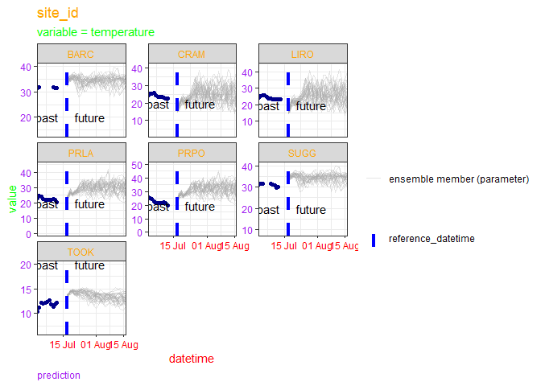
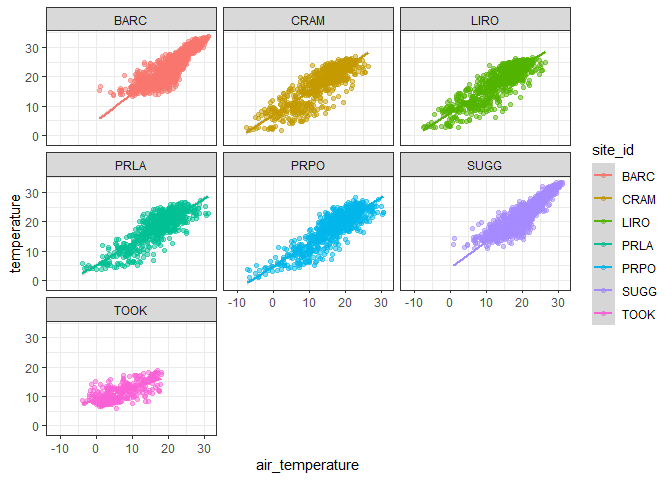
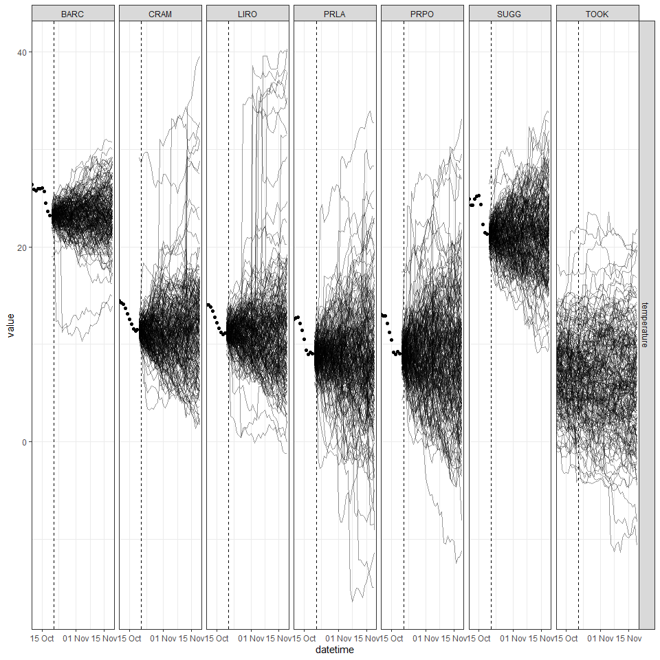
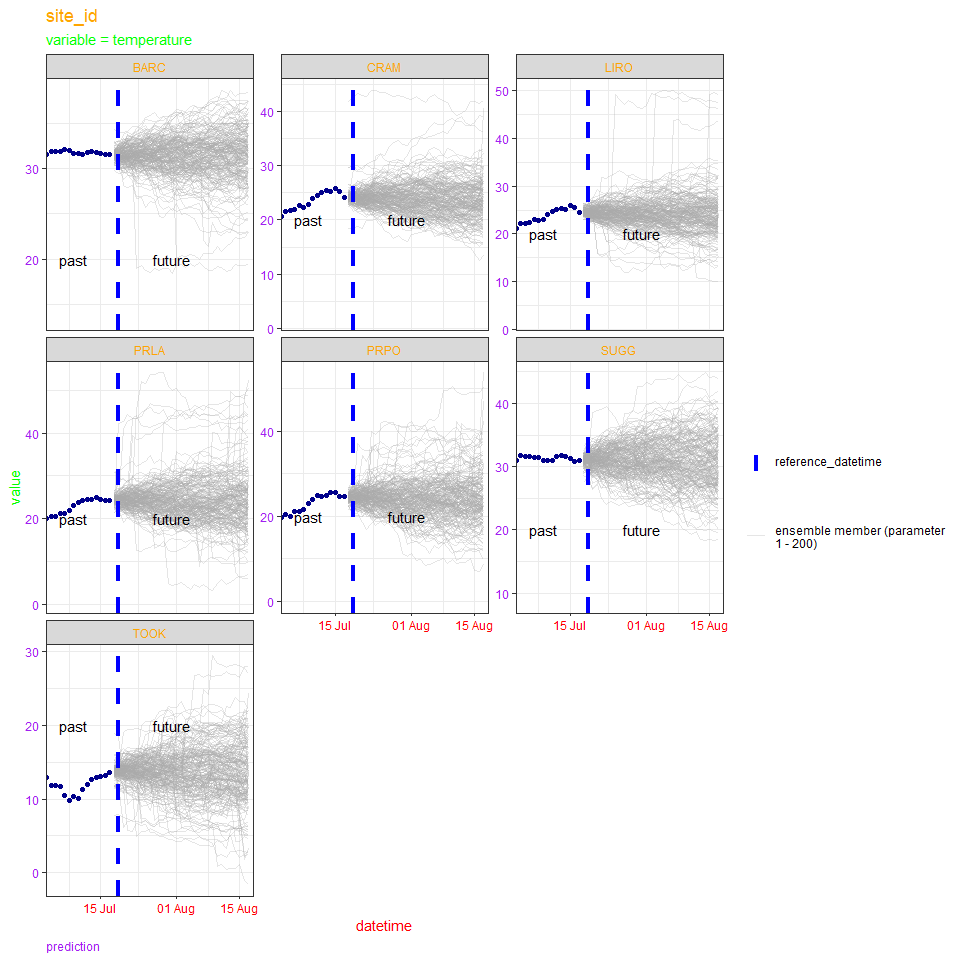
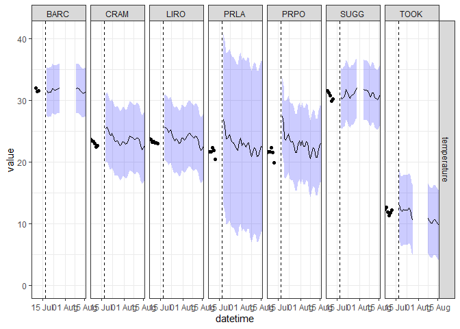

-   [1 This R markdown document](#this-r-markdown-document)
-   [2 Introduction to NEON forecast
    challenge](#introduction-to-neon-forecast-challenge)
    -   [2.1 Aquatics challenge](#aquatics-challenge)
    -   [2.2 Submission requirements](#submission-requirements)
-   [3 The forecasting workflow](#the-forecasting-workflow)
    -   [3.1 Read in the data](#read-in-the-data)
    -   [3.2 Visualise the data](#visualise-the-data)
-   [4 Introducing co-variates](#introducing-co-variates)
    -   [4.1 Download co-variates](#download-co-variates)
        -   [4.1.1 Download historic data](#download-historic-data)
        -   [4.1.2 Download future weather
            forecasts](#download-future-weather-forecasts)
-   [5 Model 1: Linear model with
    covariates](#model-1-linear-model-with-covariates)
    -   [5.1 Specify forecast model](#specify-forecast-model)
    -   [5.2 Convert to EFI standard for
        submission](#convert-to-efi-standard-for-submission)
    -   [5.3 Submit forecast](#submit-forecast)
    -   [5.4 TASKS](#tasks)
    -   [5.5 Register your participation](#register-your-participation)
-   [6 Alternative forecasting
    approaches](#alternative-forecasting-approaches)
    -   [6.1 Model 2: Persistence](#model-2-persistence)
        -   [6.1.1 Convert to EFI standard for
            submission](#convert-to-efi-standard-for-submission-1)
        -   [6.1.2 Write the forecast to
            file](#write-the-forecast-to-file)
        -   [6.1.3 Submit forecast](#submit-forecast-1)
        -   [6.1.4 TASKS](#tasks-1)
    -   [6.2 Model 3: Climatology model](#model-3-climatology-model)
        -   [6.2.1 Write the forecast for NEON EFI
            challenge](#write-the-forecast-for-neon-efi-challenge)
        -   [6.2.2 Submit forecast](#submit-forecast-2)
        -   [6.2.3 TASKS](#tasks-2)
-   [7 Other things that might be
    useful](#other-things-that-might-be-useful)
    -   [7.1 How the forecasts are
        scored?](#how-the-forecasts-are-scored)
    -   [7.2 Other useful R packages](#other-useful-r-packages)
    -   [7.3 Other weather variables](#other-weather-variables)
    -   [7.4 Automating your forecasting
        workflow](#automating-your-forecasting-workflow)
    -   [7.5 Alternative methods to loop through each variable-site_id
        combination](#alternative-methods-to-loop-through-each-variable-site_id-combination)

# 1 This R markdown document

This document presents workshop materials to get you started on
generating forecasts specifically for submission to the EFI-NEON
Forecasting Challenge. The Challenge goal is to create a community of
practice that builds capacity for ecological forecasting by leveraging
NEON data products. The Challenge revolves around the five theme areas
that span aquatic and terrestrial systems, and population, community,
and ecosystem processes across a broad range of ecoregions that uses
data collected by NEON. Learn more about the Challenge
[here](https://projects.ecoforecast.org/neon4cast-docs/)!

The development of these materials has been supported by NSF grants
DEB-1926388 and DBI-1933016.

To complete the workshop via this markdown document the following
packages will need to be installed:

-   `remotes`
-   `fpp3`
-   `tsibble`
-   `tidyverse`
-   `lubridate`
-   `neon4cast` (from github)

The following code chunk should be run to install packages.

``` r
install.packages('remotes')
install.packages('fpp3') # package for applying simple forecasting methods
install.packages('tsibble') # package for dealing with time series data sets and tsibble objects
install.packages('tidyverse') # collection of R packages for data manipulation, analysis, and visualisation
install.packages('lubridate') # working with dates and times
remotes::install_github('eco4cast/neon4cast') # package from NEON4cast challenge organisers to assist with forecast building and submission
```

Additionally, R version 4.2 is required to run the neon4cast package.
It’s also worth checking your Rtools is up to date and compatible with R
4.2, see
(<https://cran.r-project.org/bin/windows/Rtools/rtools42/rtools.html>).

``` r
version$version.string
```

    ## [1] "R version 4.2.0 (2022-04-22 ucrt)"

``` r
library(tidyverse)
```

    ## Warning: package 'tidyverse' was built under R version 4.2.3

    ## Warning: package 'ggplot2' was built under R version 4.2.3

    ## Warning: package 'tibble' was built under R version 4.2.3

    ## Warning: package 'tidyr' was built under R version 4.2.3

    ## Warning: package 'readr' was built under R version 4.2.3

    ## Warning: package 'purrr' was built under R version 4.2.3

    ## Warning: package 'dplyr' was built under R version 4.2.3

    ## Warning: package 'stringr' was built under R version 4.2.3

    ## Warning: package 'forcats' was built under R version 4.2.3

    ## Warning: package 'lubridate' was built under R version 4.2.3

    ## ── Attaching core tidyverse packages ──────────────────────── tidyverse 2.0.0 ──
    ## ✔ dplyr     1.1.3     ✔ readr     2.1.4
    ## ✔ forcats   1.0.0     ✔ stringr   1.5.1
    ## ✔ ggplot2   3.5.0     ✔ tibble    3.2.1
    ## ✔ lubridate 1.9.3     ✔ tidyr     1.3.1
    ## ✔ purrr     1.0.2     
    ## ── Conflicts ────────────────────────────────────────── tidyverse_conflicts() ──
    ## ✖ dplyr::filter() masks stats::filter()
    ## ✖ dplyr::lag()    masks stats::lag()
    ## ℹ Use the conflicted package (<http://conflicted.r-lib.org/>) to force all conflicts to become errors

``` r
library(lubridate)
```

If you do not wish to run the code yourself you can follow along via the
html (NEON_forecast_challenge_workshop.md), which can be downloaded from
the [Github
repository](https://github.com/eco4cast/NEON-forecast-challenge-workshop).

# 2 Introduction to NEON forecast challenge

The EFI RCN NEON Forecast Challenge asks the scientific community to
produce ecological forecasts of future conditions at NEON sites by
leveraging NEON’s open data products. The Challenge is split into five
themes that span aquatic and terrestrial systems, and population,
community, and ecosystem processes across a broad range of ecoregions.
We are excited to use this Challenge to learn more about the
predictability of ecological processes by forecasting NEON data before
it is collected.

Which modeling frameworks, mechanistic processes, and statistical
approaches best capture community, population, and ecosystem dynamics?
These questions are answerable by a community generating a diverse array
of forecasts. The Challenge is open to any individual or team from
anywhere around the world that wants to submit forecasts. Sign up
[here.](https://projects.ecoforecast.org/neon4cast-docs/Participation.html).

## 2.1 Aquatics challenge

What: Freshwater surface water temperature, oxygen, and chlorophyll-a.

Where: 7 lakes and 27 river/stream NEON sites.

When: Daily forecasts for at least 30-days in the future. New forecast
submissions, that use new data to update the forecast, are accepted
daily. The only requirement is that submissions are predictions of the
future at the time the forecast is submitted.

Today we will focus on lake sites only and will start with forecasting
water temperature. For the challenge, you can chose to submit to either
the lakes, rivers or streams or all three! You can also chose to submit
any of the three focal variables (temperature, oxygen, and chlorophyll).
Find more information about the aquatics challenge
[here](https://projects.ecoforecast.org/neon4cast-docs/Aquatics.html).

## 2.2 Submission requirements

For the Challange, forecasts must include quantified uncertainty. The
file can represent uncertainty using an ensemble forecast (multiple
realizations of future conditions) or a distribution forecast (with mean
and standard deviation), specified in the family and parameter columns
of the forecast file.

For an ensemble forecast, the `family` column uses the word `ensemble`
to designate that it is a ensemble forecast and the parameter column is
the ensemble member number (1, 2, 3 …). For a distribution forecast, the
`family` column uses the word `normal` to designate a normal
distribution and the parameter column must have the words mu and sigma
for each forecasted variable, site_id, and datetime. For forecasts that
don’t have a normal distribution we recommend using the ensemble format
and sampling from your non-normal distribution to generate a set of
ensemble members that represents your distribution. I will go through
examples of both `ensemble` and `normal` forecasts as examples.

The full list of required columns and format can be found in the
[Challenge
documentation](https://projects.ecoforecast.org/neon4cast-ci/instructions.html).

# 3 The forecasting workflow

## 3.1 Read in the data

We start forecasting by first looking at the historic data - called the
‘targets’. These data are available near real-time, with the latency of
approximately 24-48 hrs. Here is how you read in the data from the
targets file available from the EFI server.

``` r
#read in the targets data
targets <- read_csv('https://data.ecoforecast.org/neon4cast-targets/aquatics/aquatics-targets.csv.gz')
```

Information on the NEON sites can be found in the
`NEON_Field_Site_Metadata_20220412.csv` file in the `eco4cast`
repository on GitHub. It can be filtered to only include aquatic sites.
This table has information about the field sites, including location,
ecoregion, information about the watershed (e.g. elevation, mean annual
precipitation and temperature), and lake depth.

``` r
# read in the sites data
aquatic_sites <- read_csv("https://raw.githubusercontent.com/eco4cast/neon4cast-targets/main/NEON_Field_Site_Metadata_20220412.csv") |>
  dplyr::filter(aquatics == 1)
```

Let’s take a look at the targets data!

    ## # A tibble: 11 × 4
    ##    datetime   site_id variable    observation
    ##    <date>     <chr>   <chr>             <dbl>
    ##  1 2017-04-23 ARIK    temperature       12.7 
    ##  2 2017-04-24 ARIK    chla              NA   
    ##  3 2017-04-24 ARIK    oxygen             7.10
    ##  4 2017-04-24 ARIK    temperature       14.8 
    ##  5 2017-04-25 ARIK    chla              NA   
    ##  6 2017-04-25 ARIK    oxygen             6.58
    ##  7 2017-04-25 ARIK    temperature       15.5 
    ##  8 2017-04-26 ARIK    chla              NA   
    ##  9 2017-04-26 ARIK    oxygen             7.32
    ## 10 2017-04-26 ARIK    temperature       13.0 
    ## 11 2017-04-27 ARIK    chla              NA

The columns of the targets file show the time step (daily for aquatics
challenge), the 4 character site code (`site_id`), the variable being
measured, and the mean daily observation. To look at only the lakes we
can subset the targets and aquatic sites to those which have the
`field_site_subtype` of `Lake`.

``` r
lake_sites <- aquatic_sites %>%
  filter(field_site_subtype == 'Lake')

targets <- targets %>%
  filter(site_id %in% lake_sites$field_site_id)
```

## 3.2 Visualise the data


We can think about what type of models might be useful to predict these
variables at these sites. Below are descriptions of three simple models
which have been constructed to get you started forecasting:

-   We could use information about current conditions to predict the
    next day. What is happening today is usually a good predictor of
    what will happen tomorrow (Model 2 - Persistence).
-   We could also look at the lake variables’ relationship(s) with other
    variable. Could we use existing forecasts about the weather to
    generate forecasts about lake variables (Model 1 - Linear Model with
    Co-variates).
-   And we could think about what the historic data tells us about this
    time of year. January this year is likely to be similar to January
    last year (Model 3 - Climatology/Seasonal Naive Model)

To start, we will produce forecasts for just one of these target
variables, surface water temperature.

``` r
targets <- targets %>%
  filter(variable == 'temperature')
```

# 4 Introducing co-variates

One important step to overcome when thinking about generating forecasts
is to include co-variates in the model. A water temperature forecast,
for example, may be benefit from information about past and future
weather. The neon4cast challenge package includes functions for
downloading past and future NOAA weather forecasts for all of the NEON
sites. The 3 types of data are as follows:

-   stage_1: raw forecasts - 31 member ensemble forecasts at 3 hr
    intervals for the first 10 days, and 6 hr intervals for up to 35
    days at the NEON sites.
-   stage_2: a processed version of Stage 1 in which fluxes are
    standardized to per second rates, fluxes and states are interpolated
    to 1 hour intervals and variables are renamed to match conventions.
    We recommend this for obtaining future weather. Future weather
    forecasts include a 30-member ensemble of equally likely future
    weather conditions.
-   stage_3: can be viewed as the “historical” weather and is
    combination of day 1 weather forecasts (i.e., when the forecasts are
    most accurate).

This code creates a connection to the dataset hosted on the eco4cast
server using `arrow` functions. To download the data you have to tell
the function to `collect()` it. These data sets can be subset and
filtered using `dplyr` functions prior to download to limit the memory
usage.

You can read more about the NOAA forecasts available for the NEON sites
[here:](https://projects.ecoforecast.org/neon4cast-docs/Shared-Forecast-Drivers.html)

## 4.1 Download co-variates

### 4.1.1 Download historic data

We will generate a water temperature forecast using `air_temperature` as
a co-variate. Note: This code chunk can take a few minutes to execute as
it accesses the NOAA data.

``` r
# past stacked weather
noaa_past_s3 <- neon4cast::noaa_stage3()

variables <- c("air_temperature")
#Other variable names can be found at https://projects.ecoforecast.org/neon4cast-docs/Shared-Forecast-Drivers.html#stage-3

noaa_past <- noaa_past_s3  |> 
  dplyr::filter(site_id %in% lake_sites$field_site_id,
                datetime >= ymd('2017-01-01'),
                variable %in% variables) |> 
  dplyr::collect()

noaa_past
```

    ## # A tibble: 7,749,721 × 7
    ##    parameter datetime            variable   prediction family reference_datetime
    ##        <dbl> <dttm>              <chr>           <dbl> <chr>  <lgl>             
    ##  1         0 2020-09-24 00:00:00 air_tempe…       291. ensem… NA                
    ##  2         1 2020-09-24 00:00:00 air_tempe…       291. ensem… NA                
    ##  3         2 2020-09-24 00:00:00 air_tempe…       291. ensem… NA                
    ##  4         3 2020-09-24 00:00:00 air_tempe…       292. ensem… NA                
    ##  5         4 2020-09-24 00:00:00 air_tempe…       291. ensem… NA                
    ##  6         5 2020-09-24 00:00:00 air_tempe…       290. ensem… NA                
    ##  7         6 2020-09-24 00:00:00 air_tempe…       291. ensem… NA                
    ##  8         7 2020-09-24 00:00:00 air_tempe…       291. ensem… NA                
    ##  9         8 2020-09-24 00:00:00 air_tempe…       292. ensem… NA                
    ## 10         9 2020-09-24 00:00:00 air_tempe…       291. ensem… NA                
    ## # ℹ 7,749,711 more rows
    ## # ℹ 1 more variable: site_id <chr>

This is a stacked ensemble of the one day ahead forecasts. To get an
estimate of the historic conditions we can take a mean of these
ensembles. We will also convert the temperatures from Kelvin to Celsius
so that the values are on a familiar scale.

``` r
# aggregate the past to mean values
noaa_past_mean <- noaa_past |> 
  mutate(datetime = as_date(datetime)) |> 
  group_by(datetime, site_id, variable) |> 
  summarize(prediction = mean(prediction, na.rm = TRUE), .groups = "drop") |> 
  pivot_wider(names_from = variable, values_from = prediction) |> 
  # convert air temp to C
  mutate(air_temperature = air_temperature - 273.15)
```

We can then look at the future weather forecasts in the same way but
using the `noaa_stage2()`. The forecast becomes available from NOAA at
5am UTC the following day, so we take the air temperature forecast from
yesterday (`noaa_date`) to make the water quality forecasts. Then we can
use the ensembles to produce uncertainty in the water temperature
forecast by forecasting multiple (31) future water temperatures.

### 4.1.2 Download future weather forecasts

``` r
# New forecast only available at 5am UTC the next day

forecast_date <- Sys.Date() 
noaa_date <- forecast_date - days(1)

noaa_future_s3 <- neon4cast::noaa_stage2(start_date = as.character(noaa_date))
variables <- c("air_temperature")

noaa_future <- noaa_future_s3 |> 
  dplyr::filter(datetime >= forecast_date,
                site_id %in% lake_sites$field_site_id,
                variable %in% variables) |> 
  collect()
```

The forecasts are hourly and we are interested in using daily mean air
temperature for water temperature forecast generation.

``` r
noaa_future_daily <- noaa_future |> 
  mutate(datetime = as_date(datetime)) |> 
  # mean daily forecasts at each site per ensemble
  group_by(datetime, site_id, parameter, variable) |> 
  summarize(prediction = mean(prediction)) |>
  pivot_wider(names_from = variable, values_from = prediction) |>
  # convert to Celsius
  mutate(air_temperature = air_temperature - 273.15) |> 
  select(datetime, site_id, air_temperature, parameter)
```

    ## `summarise()` has grouped output by 'datetime', 'site_id', 'parameter'. You can
    ## override using the `.groups` argument.

``` r
noaa_future_daily
```

    ## # A tibble: 7,595 × 4
    ## # Groups:   datetime, site_id, parameter [7,595]
    ##    datetime   site_id air_temperature parameter
    ##    <date>     <chr>             <dbl>     <dbl>
    ##  1 2024-10-21 BARC               20.9         0
    ##  2 2024-10-21 BARC               21.3         1
    ##  3 2024-10-21 BARC               21.7         2
    ##  4 2024-10-21 BARC               19.9         3
    ##  5 2024-10-21 BARC               20.5         4
    ##  6 2024-10-21 BARC               22.3         5
    ##  7 2024-10-21 BARC               21.2         6
    ##  8 2024-10-21 BARC               22.1         7
    ##  9 2024-10-21 BARC               21.1         8
    ## 10 2024-10-21 BARC               21.5         9
    ## # ℹ 7,585 more rows

Now we have a timeseries of historic data and a 30 member ensemble
forecast of future air temperatures


# 5 Model 1: Linear model with covariates

We will fit a simple linear model between historic air temperature and
the water temperature targets data. Using this model we can then use our
future estimates of air temperature (all 31 ensembles) to estimate water
temperature at each site. The ensemble weather forecast will therefore
propagate uncertainty into the water temperature forecast and give an
estimate of driving data uncertainty.

We will start by joining the historic weather data with the targets to
aid in fitting the linear model.

``` r
targets_lm <- targets |> 
  filter(variable == 'temperature') |>
  pivot_wider(names_from = 'variable', values_from = 'observation') |> 
  left_join(noaa_past_mean, 
            by = c("datetime","site_id"))

targets_lm[1000:1010,]
```

    ## # A tibble: 11 × 4
    ##    datetime   site_id temperature air_temperature
    ##    <date>     <chr>         <dbl>           <dbl>
    ##  1 2020-10-16 BARC             NA            25.5
    ##  2 2020-10-17 BARC             NA            22.6
    ##  3 2020-10-18 BARC             NA            23.6
    ##  4 2020-10-19 BARC             NA            24.1
    ##  5 2020-10-20 BARC             NA            24.7
    ##  6 2020-10-21 BARC             NA            24.4
    ##  7 2020-10-22 BARC             NA            23.8
    ##  8 2020-10-23 BARC             NA            23.7
    ##  9 2020-10-24 BARC             NA            24.0
    ## 10 2020-10-25 BARC             NA            24.9
    ## 11 2020-10-26 BARC             NA            24.9

To fit the linear model we use the base R `lm()` but there are also
methods to fit linear (and non-linear) models in the `fable::` package.
You can explore the
[documentation](https://otexts.com/fpp3/regression.html) for more
information on the `fable::TSLM()` function. We can fit a separate
linear model for each site. For example, at Lake Suggs, this would look
like:

``` r
example_site <- 'SUGG'

site_target <- targets_lm |> 
  filter(site_id == example_site)

noaa_future_site <- noaa_future_daily |> 
  filter(site_id == example_site)

#Fit linear model based on past data: water temperature = m * air temperature + b
fit <- lm(site_target$temperature ~ site_target$air_temperature)
    
# use linear regression to forecast water temperature for each ensemble member
forecasted_temperature <- fit$coefficients[1] + fit$coefficients[2] * noaa_future_site$air_temperature
```

Next, we will can loop through this for each site to create a site-wise
forecast of water temperature based on a linear model and each
forecasted air temperature. After we run this forecast for each site, we
will bind them together to submit as one forecast.

## 5.1 Specify forecast model

``` r
temp_lm_forecast <- NULL

for(i in 1:length(lake_sites$field_site_id)) {  
  
  example_site <- lake_sites$field_site_id[i]
  
  site_target <- targets_lm |>
    filter(site_id == example_site)

  noaa_future_site <- noaa_future_daily |> 
    filter(site_id == example_site)
  
  #Fit linear model based on past data: water temperature = m * air temperature + b
  fit <- lm(site_target$temperature ~ site_target$air_temperature)
  # fit <- lm(site_target$temperature ~ ....)
    
  # use linear regression to forecast water temperature for each ensemble member
  forecasted_temperature <- fit$coefficients[1] + fit$coefficients[2] * noaa_future_site$air_temperature
    
  # put all the relavent information into a tibble that we can bind together
  temperature <- tibble(datetime = noaa_future_site$datetime,
                        site_id = example_site,
                        parameter = noaa_future_site$parameter,
                        prediction = forecasted_temperature,
                        variable = "temperature")
  
  temp_lm_forecast <- dplyr::bind_rows(temp_lm_forecast, temperature)
  message(example_site, ' temperature forecast run')
  
}
```

    ## BARC temperature forecast run

    ## CRAM temperature forecast run

    ## LIRO temperature forecast run

    ## PRLA temperature forecast run

    ## PRPO temperature forecast run

    ## SUGG temperature forecast run

    ## TOOK temperature forecast run

We now have 31 possible forecasts of water temperature at each site and
each day, one for each air of the ensemble temperature forecasts. On
this plot each line represents one of the possible forecasts and the
range of forecasted water temperature is a simple quantification of the
uncertainty in our forecast.

Looking back at the forecasts we produced:



## 5.2 Convert to EFI standard for submission

For an ensemble forecast the documentation specifies the following
columns:

-   `project_id`: use `neon4cast`.
-   `datetime`: forecast timestamp for each time step
-   `reference_datetime`: The start of the forecast; this should be 0
    times steps in the future. This should only be one value of
    reference_datetime in the file
-   `duration`: the time-step of the forecast. Use the value of P1D for
    a daily forecast and PT1H for an hourly forecast.
-   `site_id`: NEON code for site
-   `family`: name of probability distribution that is described by the
    parameter values in the parameter column; the distribution
    e.g,(`normal`) or `ensemble` are allowed.
-   `parameter`: integer value for forecast replicate
-   `variable`: standardized variable name from the theme
-   `prediction`: forecasted value
-   `model_id`: model name (no spaces). Any model_id that includes
    ‘example’ will not be included in analysis. It will still be
    evaluated against observations but will be deleted. This is good for
    testing and trying out new modelling ideas.

We need to make sure the dataframe is in the correct format and then we
can submit this to the challenge as well! This is an ensemble forecast
(specified in the `family` column).

``` r
# Remember to change the model_id when you make changes to the model structure!
my_model_id <- 'example_ID'

temp_lm_forecast_EFI <- temp_lm_forecast %>%
  filter(datetime > forecast_date) %>%
  mutate(model_id = my_model_id,
         reference_datetime = forecast_date,
         family = 'ensemble',
         parameter = as.character(parameter),
         duration = 'P1D',
         project_id = 'neon4cast') %>%
  select(datetime, reference_datetime, site_id, family, parameter, variable, prediction, model_id)
```

## 5.3 Submit forecast

Files need to be in the correct format for submission. The forecast
organizers have created tools to help aid in the submission process.
These tools can be downloaded from Github using
`remotes::install_github(eco4cast/neon4cast)`. These include functions
for submitting, scoring and reading forecasts:

-   `submit()` - submit the forecast file to the neon4cast server where
    it will be scored
-   `forecast_output_validator()` - will check the file is in the
    correct format to be submitted

The file name needs to be in the format
theme-reference_datetime-model_id

``` r
# Start by writing the forecast to file
theme <- 'aquatics'
date <- temp_lm_forecast_EFI$reference_datetime[1]
forecast_name_1 <- paste0(temp_lm_forecast_EFI$model_id[1], ".csv")
forecast_file_1 <- paste(theme, date, forecast_name_1, sep = '-')
forecast_file_1
```

    ## [1] "aquatics-2024-10-21-example_ID.csv"

``` r
write_csv(temp_lm_forecast_EFI,forecast_file_1)

neon4cast::forecast_output_validator(forecast_file_1)
```

    ## aquatics-2024-10-21-example_ID.csv

    ## ✔ file has model_id column
    ## ✔ forecasted variables found correct variable + prediction column
    ## ✔ temperature is a valid variable name
    ## ✔ file has correct family and parameter columns
    ## ✔ file has site_id column
    ## ✔ file has datetime column
    ## ✔ file has correct datetime column

    ## Warning: file missing duration column (values for the column: daily = P1D,
    ## 30min = PT30M)

    ## Warning: file missing project_id column (use `neon4cast` as the project_id

    ## ✔ file has reference_datetime column
    ## Forecast format is valid

    ## [1] TRUE

``` r
# can uses the neon4cast::forecast_output_validator() to check the forecast is in the right format
neon4cast::submit(forecast_file = forecast_file_1),
                  ask = FALSE) # if ask = T (default), it will produce a pop-up box asking if you want to submit
```

Is the linear model a reasonable relationship between air temperature
and water temperature? Would some non-linear relationship be better?
What about using yesterday’s air and water temperatures to predict
tomorrow? Or including additional parameters? There’s a lot of
variability in water temperatures unexplained by air temperature alone.
Could we use the residuals from this fit to add an extra source of
uncertainty?

    ## `geom_smooth()` using formula = 'y ~ x'



## 5.4 TASKS

Possible modifications to Model 1 - simple linear model:

-   Include additional NOAA co-variates in the linear model (remember to
    ‘collect’ and subset the right data from NOAA)
-   Specify a non-linear relationship
-   Try forecasting another variable (oxygen or chlorophyll) - could you
    use your water temperature to estimate dissolved oxygen
    concentration at the surface?
-   Include a lag in the predictors

Remember to change the `model_id` so we can differentiate different
forecasts!

## 5.5 Register your participation

It’s really important that once you start submitting forecasts to the
Challenge that you register your participation. We ask that you complete
this [form](https://forms.gle/kg2Vkpho9BoMXSy57) which asks you some
simple questions about your forecast and team. This is crucial for a
couple of reasons:

1.  We can keep track different forecast submissions during the scoring
    process to see which forecast is performing the best. Your
    `model_id` will be used to track the submissions so any new forecast
    model requires a new `model_id`.
2.  The form gives consent for submissions to be included in
    Challenge-wide syntheses being carried out by the Challenge
    organisers. Long-term partipants in the Challenge will be invited to
    join the synthesis projects on an opt-in basis.

Questions about the
[Challenge](https://projects.ecoforecast.org/neon4cast-ci/),
registration and synthesis participation can be directed to [Challenge
Organisers](mailto:eco4cast.initiative@gmail.com).

------------------------------------------------------------------------

# 6 Alternative forecasting approaches

The following sections provide additional information on other simple
forecasting methods that could be used to generate ecological forecasts
for the NEON Forecasting Challenge.

## 6.1 Model 2: Persistence

This forecasting method uses a method from the `fable` R package which
is installed via `fpp3` package. The `fable` package implements a range
of different forecasting methods including Persistence Models, Moving
Average Models, ARIMA Models and Time Series Models. The package
integrates with `tidyverse` syntax and has good documentation and
examples found [here](https://otexts.com/fpp3/). `fable` and
`fabletools`, are installed as part of the `fpp3` package and produce
and deal with `mable` (model table) and `fable` (forecast table)
objects. We will also use the `tidyverse` to manipulate and visualise
the target data and forecasts.

``` r
# install.packages('fpp3') # package for applying simple forecasting methods
# install.packages('tsibble') # package for dealing with time series data sets and tsibble objects

library(fpp3)      # package for forecasting
library(tsibble)   # package for dealing with time series data sets

library(neon4cast) 

# suppreses dplyr's summarise message
options(dplyr.summarise.inform = FALSE)
```

`fable` has some simple models that can be fitted to the target data.
`fable` models require data to be in a tidy `tsibble` format. Tools for
dealing with tsibble objects are found in the `tsibble` package.
`tsibble` objects are similar in structure to `tibble` objects but have
a built in timeseries element. This is specified in their creation as
the `index` or time variable. You also need to give the tsibble a `key`,
which in combination with the index will uniquely identify each record.
In our case the key variables will be `site_id` and `variable`. These
models also require explicit gaps to be added for missing values
(`fill_gaps()` will do this!) .

For Random Walk (RW) forecasts (i.e., persistence), we simply set the
forecast value be the value of the last observation. Start by reading in
the observations. We will look at water temperature to start with.

The model would be specified and then the forecast generated as follows
(using `fable` and `fabletools` functions).

To specify the model we use `model(RW = RW(observation))` and then the
forecast can be created by piping this model to the `generate()`
function. `h = 30` tells the model how far in the future to forecast,
and `bootstrap = TRUE` tells the function to generate multiple
uncertainty through bootstrapping. Bootstrapping is where we run the
forecast multiple times with a random error term drawn from the
residuals of the fitted model. Doing this repeatedly, we obtain many
possible futures (an ensemble forecast). We decide how many of these
possibilities to simulate with the `times =...` argument.

``` r
targets_subset <- targets %>%
  filter(site_id == 'SUGG') 

RW_model <- targets_subset %>% 
  # fable requires a tsibble object with explicit gaps
  tsibble::as_tsibble(key = c('variable', 'site_id'), index = 'datetime') %>%
  tsibble::fill_gaps() %>%
  model(RW = RW(observation))

RW_daily_forecast <- RW_model %>% 
  generate(h = 30, bootstrap = T, times = 50)
```

The forecast produces an error (‘the first lag window for simulations
must be within the model’s training set’). Why would that be? If you
look at the targets data we can see that yesterday did not have an
observation, so the model cannot produce a persistence forecast.

``` r
targets |> 
  filter(site_id == 'SUGG') |> 
  summarise(last_ob = max(datetime)) |> 
  pull()
```

    ## [1] "2024-10-19"

Specifying the model and forecasts in this way would be fine if we have
data observed to yesterday but this often isn’t the case. For the NEON
data the usual data latency is between 24-72 hours. This is obviously
not ideal, but we need to think of a way to produce forecasts with the
data we have. Instead we can start the forecast at the last observation,
rather than yesterday. The forecast is run from that observation through
today and then for 30 days in the future. In practice this means telling
fable to forecasts 30 days + the number of days since last observation
and then trimming the days that are in the past, before submitting the
forecast.

We calculate the `reference_datetime` (starting data) and total
`horizon` for each `site_id` and `variable` combination (here just
temperature).

``` r
# For the RW model need to start the forecast at the last non-NA day and then run to 30 days in the future
forecast_starts <- targets %>%
  filter(!is.na(observation)) %>%
  group_by(site_id, variable) %>%
  # Start the day after the most recent non-NA value
  summarise(reference_datetime = max(datetime) + 1) %>% # Date 
  mutate(h = (Sys.Date() - reference_datetime) + 30) %>% # Horizon value 
  ungroup() 

forecast_starts
```

    ## # A tibble: 7 × 4
    ##   site_id variable    reference_datetime h      
    ##   <chr>   <chr>       <date>             <drtn> 
    ## 1 BARC    temperature 2024-10-20         31 days
    ## 2 CRAM    temperature 2024-10-20         31 days
    ## 3 LIRO    temperature 2024-10-20         31 days
    ## 4 PRLA    temperature 2024-10-20         31 days
    ## 5 PRPO    temperature 2024-10-20         31 days
    ## 6 SUGG    temperature 2024-10-20         31 days
    ## 7 TOOK    temperature 2024-09-19         62 days

You can see that the sites have different start dates, based on when the
last observation was taken. We want to fit each site (and variable)
model separately depending on its start date and calculated horizon. To
do this I have written a custom function that runs the RW forecast.
Within this function we:

-   Tidy: Takes the targets and fills with NAs, and filters up to the
    last non-NA value. The data must have explicit gaps for the full
    time series and must be in a tsibble format to run `fable`. Every
    time step up to the start of the forecast must exist even if it is
    filled with NAs (except the day before the forecast starts)!
-   Specify: Fits the RW model. We can also specify transformations to
    use within the model. The `fable` package will automatically
    back-transform common transformations in the forecasts whenever one
    is used in the model definition. Common transformations include
    box-cox, logarithmic, and square root. The simplest specification of
    the model is
    `RW_model <- targets_use %>% model(RW = RW(observation))` which
    stores the model table (a `mable`) in the object called `RW_model`.
-   Forecast: Then using this model, we run a forecast! We can specify
    whether bootstrapping is used and the number of bootstraps
    (`bootstrap = T`).

Within this function, there are also if statements to test whether there
are whole datasets missing, as well as messages which can be turned
on/off with the `verbose =` argument.

``` r
# Function carry out a random walk forecast
RW_daily_forecast <- function(site, 
                              var,
                              h,
                              bootstrap = FALSE, boot_number = 200,
                              transformation = 'none', verbose = TRUE,...) {
  
  # message('starting ',site_var_combinations$site[i], ' ', site_var_combinations$var[i], ' forecast')
  
  ### TIDY
  # filter the targets data set to the site_var pair
  targets_use <- targets %>%
    dplyr::filter(site_id == site,
           variable == var) %>%
    tsibble::as_tsibble(key = c('variable', 'site_id'), index = 'datetime') %>%
    
    # add NA values up to today (index)
    tsibble::fill_gaps(.end = Sys.Date()) %>%
    # Remove the NA's put at the end, so that the forecast starts from the last day with an observation,
    dplyr::filter(datetime < forecast_starts$reference_datetime[which(forecast_starts$site_id == site &
                                                                forecast_starts$variable == var)])
  


  # SPECIFY 
  
    # Do you want to apply a transformation? 
    if (transformation == 'log') {
      RW_model <- targets_use %>%
        model(RW = fable::RW(log(observation)))
    }
    
    if (transformation == 'log1p') {
      RW_model <- targets_use %>%
        model(RW = fable::RW(log1p(observation)))
    }
    
    if (transformation == 'sqrt') {
      RW_model <- targets_use %>%
        model(RW = fable::RW(sqrt(observation)))
    }
    
    if (transformation == 'none') {
      RW_model <- targets_use %>%
        model(RW = fable::RW(observation))
    }
    
    #FORECAST
    # Do you want to do a bootstrapped forecast?
    if (bootstrap == T) {
      forecast <- RW_model %>% 
        generate(h = as.numeric(forecast_starts$h[which(forecast_starts$site_id == site &
                                                          forecast_starts$variable == var)]),
                             bootstrap = T,
                             times = boot_number)
    }  else
      forecast <- RW_model %>% 
        forecast(h = as.numeric(forecast_starts$h[which(forecast_starts$site_id == site &
                                                                      forecast_starts$variable == var)]))
    
  if (verbose == T) {
    message(
      site,
      ' ',
      var,
      ' forecast with transformation = ',
      transformation,
      ' and bootstrap = ',
      bootstrap
    )
  }
    return(forecast)
    
  
}
```

This function takes just one site and one variable as arguments. To run
across all site_id-variable combinations we can use a `for` loop. We
need a data frame that we can index from. The number of bootstraps
(`boot_number`) is set to 200. It might also be useful to apply a
transformation to some variables a `log()` transformation on the oxygen
and chlorophyll values.

We can then loop through each variable and site (row) and combine them
into a single data frame (`RW_forecasts`).

``` r
site_var_combinations <- forecast_starts |> 
  select(site_id, variable) |> 
  rename(site = site_id,
         var = variable) |> 
  
  # assign the transformation depending on the variable. 
  # For example chla and oxygen might require a log(x ) transformation
  mutate(transformation = ifelse(var %in% c('chla', 'oxygen'), 
                                 'log', 
                                 'none')) 
head(site_var_combinations)
```

    ## # A tibble: 6 × 3
    ##   site  var         transformation
    ##   <chr> <chr>       <chr>         
    ## 1 BARC  temperature none          
    ## 2 CRAM  temperature none          
    ## 3 LIRO  temperature none          
    ## 4 PRLA  temperature none          
    ## 5 PRPO  temperature none          
    ## 6 SUGG  temperature none

``` r
# An empty data frame to put the forecasts in to
RW_forecast <- NULL

# Loop through each row (variable-site combination)
for (i in 1:nrow(site_var_combinations)) {
  
  forecast <- RW_daily_forecast(site = site_var_combinations$site[i],
                                var = site_var_combinations$var[i],
                                boot_number = 200,
                                bootstrap = T,
                                h = 30, 
                                verbose = F,
                                transformation = site_var_combinations$transformation[i])
  
  
  RW_forecast <- bind_rows(RW_forecast, forecast)
  
}
```

The output from the `forecast()` function is a forecast table or
`fable`, which has columns for `variable`, `site_id`, the `.model`, the
bootstrap value (1 to 200, `.rep`), and the prediction (`.sim`).

``` r
RW_forecast %>%
  filter(site_id == 'SUGG')
```

    ## # A tsibble: 6,200 x 6 [1D]
    ## # Key:       variable, site_id, .model, .rep [200]
    ##    variable    site_id .model datetime   .rep   .sim
    ##    <chr>       <chr>   <chr>  <date>     <chr> <dbl>
    ##  1 temperature SUGG    RW     2024-10-20 1      21.4
    ##  2 temperature SUGG    RW     2024-10-21 1      21.3
    ##  3 temperature SUGG    RW     2024-10-22 1      21.0
    ##  4 temperature SUGG    RW     2024-10-23 1      19.8
    ##  5 temperature SUGG    RW     2024-10-24 1      19.0
    ##  6 temperature SUGG    RW     2024-10-25 1      19.2
    ##  7 temperature SUGG    RW     2024-10-26 1      19.3
    ##  8 temperature SUGG    RW     2024-10-27 1      19.1
    ##  9 temperature SUGG    RW     2024-10-28 1      19.2
    ## 10 temperature SUGG    RW     2024-10-29 1      19.0
    ## # ℹ 6,190 more rows

How reasonable are these forecasts?? Is there a way to improve the
persistence model? Is a transformation needed?

<figure>

<figcaption aria-hidden="true">Figure: ‘random walk’ persistence
forecasts for NEON lake sites</figcaption>
</figure>

Each line on the plot is one of the ensemble members (shown in the fable
as `.rep`). You can also see that not all the “forecasted” days are true
forecasts (some are in the past), but we started the forecast at the
last observation. Therefore, when we write out the forecast and submit
it we need to make sure to only submit the true forecast (of the
future).

### 6.1.1 Convert to EFI standard for submission

For an ensemble forecast the documentation specifies the following
columns:

-   `project_id`: use `neon4cast`.
-   `datetime`: forecast timestamp for each time step
-   `reference_datetime`: The start of the forecast; this should be 0
    times steps in the future. This should only be one value of
    reference_datetime in the file
-   `duration`: the time-step of the forecast. Use the value of P1D for
    a daily forecast and PT1H for an hourly forecast.
-   `site_id`: NEON code for site
-   `family`: name of probability distribution that is described by the
    parameter values in the parameter column; only `normal` or
    `ensemble` are currently allowed.
-   `parameter`: integer value for forecast replicate (from the `.rep`
    in fable output);
-   `variable`: standardized variable name from the theme
-   `prediction`: forecasted value (from the `.sim` column in fable
    output)
-   `model_id`: model name (no spaces)

Looking back at the forecasts we produced:

<figure>

<figcaption aria-hidden="true">annotated forecasts</figcaption>
</figure>

The forecast output from `fable` needs slight modification to fit the
Challenge standards.

``` r
model_name <- 'example_RW'
RW_forecasts_EFI <- RW_forecast %>%
  rename(parameter = .rep,
         prediction = .sim) %>%
  # For the EFI challenge we only want the forecast for future
  filter(datetime > Sys.Date()) %>%
  mutate(reference_datetime = min(datetime) - lubridate::days(1),
         family = 'ensemble',
         model_id = model_name) %>%
  select(model_id, datetime, reference_datetime, site_id, family, parameter, variable, prediction) 
```

Now we have a forecast that can be submitted to the EFI challenge.

    ## # A tsibble: 6 x 8 [1D]
    ## # Key:       site_id, parameter, variable [1]
    ##   model_id   datetime   reference_datetime site_id family   parameter variable  
    ##   <chr>      <date>     <date>             <chr>   <chr>    <chr>     <chr>     
    ## 1 example_RW 2024-10-22 2024-10-21         BARC    ensemble 1         temperatu…
    ## 2 example_RW 2024-10-23 2024-10-21         BARC    ensemble 1         temperatu…
    ## 3 example_RW 2024-10-24 2024-10-21         BARC    ensemble 1         temperatu…
    ## 4 example_RW 2024-10-25 2024-10-21         BARC    ensemble 1         temperatu…
    ## 5 example_RW 2024-10-26 2024-10-21         BARC    ensemble 1         temperatu…
    ## 6 example_RW 2024-10-27 2024-10-21         BARC    ensemble 1         temperatu…
    ## # ℹ 1 more variable: prediction <dbl>

### 6.1.2 Write the forecast to file

``` r
# Start by writing the forecast to file
theme <- 'aquatics'
date <- RW_forecasts_EFI$reference_datetime[1]
forecast_name_2 <- paste0(RW_forecasts_EFI$model_id[1], ".csv")
forecast_file_2 <- paste(theme, date, forecast_name_2, sep = '-')

if (!dir.exists('Forecasts')) {
  dir.create('Forecasts')
}

write_csv(RW_forecasts_EFI, file.path('Forecasts', forecast_file_2))
```

### 6.1.3 Submit forecast

Files need to be in the correct format for submission. The forecast
organizers have created tools to help aid in the submission process.
These tools can be downloaded from Github using
`remotes::install_github(eco4cast/neon4cast)`. These include functions
for submitting, scoring and reading forecasts:

-   `submit()` - submit the forecast file to the neon4cast server where
    it will be scored
-   `forecast_output_validator()` - will check the file is in the
    correct format to be submitted

``` r
neon4cast::forecast_output_validator(file.path('Forecasts', forecast_file_2))
```

    ## Forecasts/aquatics-2024-10-21-example_RW.csv

    ## ✔ file has model_id column
    ## ✔ forecasted variables found correct variable + prediction column
    ## ✔ temperature is a valid variable name
    ## ✔ file has correct family and parameter columns
    ## ✔ file has site_id column
    ## ✔ file has datetime column
    ## ✔ file has correct datetime column

    ## Warning: file missing duration column (values for the column: daily = P1D,
    ## 30min = PT30M)

    ## Warning: file missing project_id column (use `neon4cast` as the project_id

    ## ✔ file has reference_datetime column
    ## Forecast format is valid

    ## [1] TRUE

This has checked that the file has a valid name and format that can be
submitted.

``` r
# can uses the neon4cast::forecast_output_validator() to check the forecast is in the right format
neon4cast::submit(forecast_file = file.path('Forecasts', forecast_file_2),
                  ask = F) # if ask = T (default), it will produce a pop-up box asking if you want to submit
```

### 6.1.4 TASKS

Possible modifications to the persistence RW model:

-   How does the number of ensembles change the uncertainty?
-   Are the transformations reasonable? Have a look
    [here](https://otexts.com/fpp3/ftransformations.html) about applying
    other types of transformations in Fable
-   Do you expect there to be a long term trends in that is not
    captured? Try adding a `drift()` term to the model

## 6.2 Model 3: Climatology model

An alternative approach is to look at the historic data to make
predictions about the future. The seasonal naive model in `fable` sets
each forecast to be equal to the last observed value, given the
specified lag. When we specify the lag to by 1 year, it will provide a
forecast that is the observations from the same day the previous year,
also known as a climatology model. Again we need to tidy the data to the
correct format for `fable`. We make sure there are explicit gaps (using
`fill_gaps()`) and make it into a tsibble object with `variable` and
`site_id` as the keys and `datetime` as the index. Then the `SNAIVE`
model is fit with a 1 year lag. One useful thing that the fable package
can do is that it fits the specified models to each `key` pairing
(variable, site_id) so you don’t have to specify each model for each
site and variable separately (we did not do this in Model 2 because each
site and variable has a different date of last observation).

``` r
SN_model <- targets %>%
  as_tsibble(key = c('variable', 'site_id'), index = 'datetime') %>%
  # add NA values up to today (index)
  fill_gaps(.end = Sys.Date()) %>%
  
  # Here we fit the model
  model(SN = SNAIVE(observation ~ lag('1 year')))
```

Then we use the model we’ve specified to forecast. `h = 30` specifies
the horizon of the forecast, relative to the index of the data (as 30
days). If the index, in this case `datetime`, had a different value such
as monthly, the `h =` value would be months. We use
`forecast(... , bootstrap = F)` to run a non-bootstrapped forecast. The
forecast will run for each key combination (variable-site_id). When
bootstrap = F, the model assumes a normal distribution. This would be an
example of a distributional forecast that can be submitted to the
Challenge.

``` r
SN_forecast <- SN_model %>% forecast(h = 30, bootstrap = F)
SN_forecast
```

    ## # A fable: 210 x 6 [1D]
    ## # Key:     variable, site_id, .model [7]
    ##    variable    site_id .model datetime   observation .mean
    ##    <chr>       <chr>   <chr>  <date>          <dist> <dbl>
    ##  1 temperature BARC    SN     2024-10-22  N(24, 3.8)  24.0
    ##  2 temperature BARC    SN     2024-10-23  N(24, 3.8)  23.9
    ##  3 temperature BARC    SN     2024-10-24  N(24, 3.8)  23.9
    ##  4 temperature BARC    SN     2024-10-25  N(24, 3.8)  24.0
    ##  5 temperature BARC    SN     2024-10-26  N(24, 3.8)  24.1
    ##  6 temperature BARC    SN     2024-10-27  N(24, 3.8)  24.3
    ##  7 temperature BARC    SN     2024-10-28  N(24, 3.8)  24.5
    ##  8 temperature BARC    SN     2024-10-29  N(25, 3.8)  24.7
    ##  9 temperature BARC    SN     2024-10-30  N(25, 3.8)  25.0
    ## 10 temperature BARC    SN     2024-10-31  N(25, 3.8)  24.5
    ## # ℹ 200 more rows

The output from this function is a `fable`. The prediction are held in
the `observation` column as a distribution, which gives the mean and
variance of the prediction. `N()` says that the distribution is normal,
and gives the mean and variance.

The challenge requires mean (mu) and standard deviation (sigma). We can
calculate the standard deviation of the predicted values using a
function to extract the variance and mean and create a table in the
right format for EFI. The sigma represents the uncertainty in the
forecast and is calculated from the residuals of the fitted model.

The columns needed for a distributional forecast are:

-   `project_id`: use `neon4cast`.
-   `datetime`: forecast timestamp for each time step
-   `reference_datetime`: The start of the forecast; this should be 0
    times steps in the future. This should only be one value of
    reference_datetime in the file
-   `duration`: the time-step of the forecast. Use the value of P1D for
    a daily forecast and PT1H for an hourly forecast.
-   `site_id`: NEON code for site
-   `family`: name of probability distribution that is described by the
    parameter values in the parameter column; only normal or ensemble is
    currently allowed
-   `parameter`: required to be the string mu (mean) or sigma (standard
    deviation) or the ensemble number
-   `variable`: standardized variable name from the theme
-   `prediction`: forecasted value for parameter listed in the parameter
    column (sigma or mu)

``` r
convert_to_efi_standard <- function(df, model_id){
  ## determine variable name
  var <- attributes(df)$dist
  ## Normal distribution: use distribution mean and variance
  df %>% 
    dplyr::mutate(sigma = sqrt( distributional::variance( .data[[var]] ) ) ) %>%
    dplyr::rename(mu = .mean) %>%
    dplyr::select(datetime, site_id, .model, mu, sigma) %>%
    tidyr::pivot_longer(c(mu, sigma), names_to = "parameter", values_to = var) %>%
    dplyr::rename('prediction' = var) %>%
    mutate(family = "normal",
           reference_datetime = min(datetime) - lubridate::days(1),
           model_id = model_id, 
           variable = 'temperature') %>%
    select(any_of(c('model_id', 'datetime', 'reference_datetime', 
                    'site_id', 'family', 'parameter', 'variable', 'prediction')))
}
```

``` r
model_name <- 'example_climatology'
SN_forecast_EFI <- convert_to_efi_standard(SN_forecast, 
                                           model_id = model_name)
```

    ## # A tsibble: 420 x 8 [1D]
    ## # Key:       site_id, parameter [14]
    ##    model_id      datetime   reference_datetime site_id family parameter variable
    ##    <chr>         <date>     <date>             <chr>   <chr>  <chr>     <chr>   
    ##  1 example_clim… 2024-10-22 2024-10-21         BARC    normal mu        tempera…
    ##  2 example_clim… 2024-10-22 2024-10-21         BARC    normal sigma     tempera…
    ##  3 example_clim… 2024-10-23 2024-10-21         BARC    normal mu        tempera…
    ##  4 example_clim… 2024-10-23 2024-10-21         BARC    normal sigma     tempera…
    ##  5 example_clim… 2024-10-24 2024-10-21         BARC    normal mu        tempera…
    ##  6 example_clim… 2024-10-24 2024-10-21         BARC    normal sigma     tempera…
    ##  7 example_clim… 2024-10-25 2024-10-21         BARC    normal mu        tempera…
    ##  8 example_clim… 2024-10-25 2024-10-21         BARC    normal sigma     tempera…
    ##  9 example_clim… 2024-10-26 2024-10-21         BARC    normal mu        tempera…
    ## 10 example_clim… 2024-10-26 2024-10-21         BARC    normal sigma     tempera…
    ## # ℹ 410 more rows
    ## # ℹ 1 more variable: prediction <dbl>

This is now in the correct format to be submitted to the Challenge.

<figure>

<figcaption aria-hidden="true">Figure: ‘seasonal naive’ forecasts for
lake sites. Shade area show 95% confidence intervals</figcaption>
</figure>

You can see that there are gaps in the forecasts. This is where there
was no observation for that day in the previous year. Ways we might fill
these gaps in the forecast include interpolating the values, or taking a
day-of-year mean for all years data.

### 6.2.1 Write the forecast for NEON EFI challenge

``` r
# Start by writing the forecast to file
# Start by writing the forecast to file
theme <- 'aquatics'
date <- RW_forecasts_EFI$reference_datetime[1]
forecast_name_3 <- paste0(SN_forecast_EFI$model_id[1], ".csv")
forecast_file_3 <- paste(theme, date, forecast_name_3, sep = '-')

write_csv(SN_forecast_EFI, file.path('Forecasts', forecast_file_3))
```

### 6.2.2 Submit forecast

Files need to be in the correct format with metadata for submission. The
forecast organisers have created tools to help aid in the submission
process. These tools can be downloaded from Github using
`remotes::install_github(eco4cast/neon4cast)`. These include functions
for submitting, scoring and reading forecasts:

-   `submit()` - submit the forecast file to the neon4cast server where
    it will be scored
-   `forecast_output_validator()` - will check the file is in the
    correct format to be submitted

``` r
# can uses the neon4cast::forecast_output_validator() to check the forecast is in the right format
neon4cast::submit(forecast_file = file.path('Forecasts', forecast_file_3),
                  ask = F) # if ask = T (default), it will produce a pop-up box asking if you want to submit
```

### 6.2.3 TASKS

Possible modifications to Model 3 - Seasonal Naive Model:

-   Fill gaps in forecasts - how could we modify the targets/forecast to
    get a continuous forecast for all sites
-   Explore Seasonal Naive and other simple models in
    [fable](https://otexts.com/fpp3/simple-methods.html), try adding a
    `drift` parameter (a long-term warming trend for example)
-   Can we change the lag in the model?
-   Another type of climatology model could include data from all years
    of historic data (easier to implement outside fable)

# 7 Other things that might be useful

## 7.1 How the forecasts are scored?

The Challenge implements methods from the scoringRules R package to
calculate the Continuous Rank Probability Score (CRPS) via the
`score4cast` package. This scores the optimum is the minimum value, so
we are aiming for as small a value as possible. CRPS uses information
about the variance of the forecasts as well as the estimated mean to
calculate the score by comparing it with the observation. There is some
balance between accuracy and precision. The forecasts will also be
compared with ‘null’ models (RW and climatology) More info can be found
in the
[documentation](https://projects.ecoforecast.org/neon4cast-docs/Evaluation.html)
or the `score4cast` package from EFI organizers
[here](https://github.com/eco4cast/score4cast).

You can view past submissions
[here:](https://projects.ecoforecast.org/neon4cast-dashboard/aquatics.html).
You can also the raw scores from the bucket directly. Have a look at
tutorial in `Analyse_scores/get_scores_tutorial.Rmd`.

## 7.2 Other useful R packages

Check out the neon4cast R package
([introduction](https://projects.ecoforecast.org/neon4cast-docs/Helpful-Functions.html),
and [github](https://github.com/eco4cast/neon4cast)) for other helpful
functions when developing your workflow for the submitting to the
challenge.

EFI has also produced a package that summarizes the proposed community
standards for the common formatting and archiving of ecological
forecasts. Such open standards are intended to promote interoperability
and facilitate forecast adoption, distribution, validation, and
synthesis
([introduction](https://projects.ecoforecast.org/neon4cast-docs/Helpful-Functions.html#efistandards-package)
and [github](https://github.com/eco4cast/EFIstandards))

## 7.3 Other weather variables

You can look at what other variables are available in the NOAA weather
data. There’s information in the [Challenge
documentation](https://projects.ecoforecast.org/neon4cast-docs/Shared-Forecast-Drivers.html)
too.

``` r
noaa_past_s3 %>%
  filter(site_id == 'ARIK',
         datetime > ymd('2022-01-01')) |> 
  dplyr::collect() |> 
  distinct(variable)
```

    ## # A tibble: 8 × 1
    ##   variable                                 
    ##   <chr>                                    
    ## 1 air_pressure                             
    ## 2 air_temperature                          
    ## 3 eastward_wind                            
    ## 4 northward_wind                           
    ## 5 precipitation_flux                       
    ## 6 relative_humidity                        
    ## 7 surface_downwelling_longwave_flux_in_air 
    ## 8 surface_downwelling_shortwave_flux_in_air

## 7.4 Automating your forecasting workflow

Automation is a key step to producing forecasts once you have your model
up and running and are happy with your forecasts. By automating your
forecasting workflow, reduces the “work” needed to produce the
forecasts. There are many ways to automate scripts that are written to
download observations and meteorology drivers, generate forecasts, and
submit forecasts. Two tools that many have used are: cron jobs (see the
R package `cronR`) that execute tasks at user specifics times and Github
actions. There are examples of how you might go about implementing this
in the [example github
repository](https://github.com/eco4cast/neon4cast-example), using github
actions and binder.

Take a look at the `Automate_forecast/automation_tutorial.md` for
detailed walk-through about how to set up a GitHub action.

## 7.5 Alternative methods to loop through each variable-site_id combination

Using the `purrr` package we can also loop through each combination of
site_id and variable combination. This is more efficient computationally
than the for loop. You need to create a dataframe with each argument as
a column. Then specify this, along with the RW function as arguments in
`pmap_dfr`. The `dfr` part of the function specifies that the output
should be use row_bind into a dataframe.

``` r
site_var_combinations <- 
  # Gets every combination of site_id and variable
  expand.grid(site = unique(targets$site_id),
              var = unique(targets$variable)) %>%
  # assign the transformation depending on the variable.
  mutate(transformation = 'none') %>%
  mutate(boot_number = 200,
         h = 30,
         bootstrap = T, 
         verbose = T)

# Runs the RW forecast for each combination of variable and site_id
RW_forecasts <- purrr::pmap_dfr(site_var_combinations, RW_daily_forecast) 
```
